---
## Author
author:
    - Александрова У.В.,
    - Волгин И.А,
    - Голощапов Я.В.,
    - Дворкина Е.В.,
    - Серегина И.А.
## Title
title: Лабораторная работа№3-D «ЗАЩИТА КОНТРОЛЛЕРА ДОМЕНА ПРЕДПРИЯТИЯ»
subtitle: "Кибербезопасность предприятия"
license: CC BY
date: today
date-format: "2025-10-30" # Example: 2025-10-15
---

# Информация

## Cостав команды

Александрова Ульяна Вадимовна

Волгин Иван Алексеевич

Голощапов Ярослав Вячеславович

Дворкина Ева Владимировна

Серёгина Ирина Андреевна

## Цели и задачи

  Обнаружить, проанализировать и закрыть уязвимости:

  1) Уязвимость CVE-2022-27228 - Bitrix vote CMS Bitrix;
  2) Уязвимость CVE-2021-22204/22205 - GitLab RCE;
  3) Уязвимость CVE-2022-29464 - WSO2 API Manager RCE.

  Определить и устранить последствия эксплуатации уязвимостей:

  1) Deface веб-панели;
  2) Meterpreter-сессия на сервере GitLab;
  3) WSO2 User Web - создание пользователя в веб-панели.

  Разработать и применить меры по устранению выявленных уязвимостей.

# Выполнение лабораторной работы

## Обнаружение уязвимости CVE-2022-27228 (Bitrix)

:::::::::::::: {.columns align=center}
::: {.column width="50%"}

1) PHP-скрипт с кодом для произвольного удаленного выполнения команд.
2-3) внедрение полезной нагрузки в HTTP-запросе.
4) информирование о скачивании исполняемого файла с машины нарушителя.

{#fig-101 width=50%}

:::
::: {.column width="50%"}

{#fig-102 width=50%}

:::
::::::::::::::

## Обнаружение уязвимости CVE-2022-27228 (Bitrix)

:::::::::::::: {.columns align=center}
::: {.column width="50%"}

В логах `/var/log/apache2/access.log` обнаружена полезная нагрузка payload, так же видим получение данных из скрипта caidao.php. 

:::
::: {.column width="50%"}

{#fig-001 width=50%}

:::
::::::::::::::

## Обнаружение уязвимости CVE-2022-27228 (Bitrix)

При просмотре содержимого полезной нагрузки отобразится информация о скачивании веб-backdoor по пути /var/www/html/caidao.php

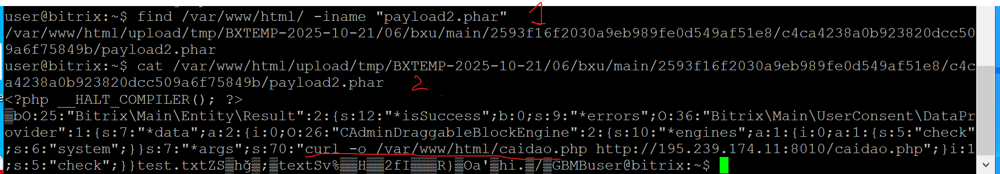{#fig-002 width=50%}

## Карточка инцидента

Добавляем карточку инцидента 

{#fig-004 width=50%}

## Обнаружение уязвимости "SQL-инъекция"

:::::::::::::: {.columns align=center}
::: {.column width="20%"}

Видим использование определенного типа инъекции (Blind SQL-Injection), а также загрузку вредоносного файла с php скриптом, что может указывать на использование php reverse shell и выставление права доступа на выполнение.

:::
::: {.column width="40%"}

{#fig-003 width=50%}

:::
::: {.column width="40%"}

{#fig-004 width=50%}

:::
::::::::::::::

## Обнаружение Meterpreter-сессии с узлом Bitrix CMS

:::::::::::::: {.columns align=center}
::: {.column width="20%"}

Для обнаружения повышения привилегий необходимо просмотреть наличие сокетов с машиной нарушителя с помощью команды ss -tp

:::
::: {.column width="40%"}

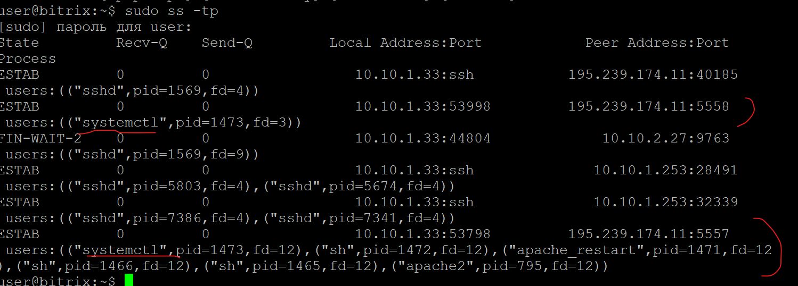{#fig-013 width=50%}

:::
::: {.column width="40%"}

{#fig-015 width=50%}

:::
::::::::::::::

## Обнаружение Meterpreter-сессии с узлом Bitrix CMS

:::::::::::::: {.columns align=center}
::: {.column width="20%"}

При просмотре содержимого скрипта script.sh обнаружено, что данный файл задает переменное окружение на директорию /var/www/html/upload, исполняет файл apache_restart.

:::
::: {.column width="40%"}

{#fig-016 width=50%}

:::
::: {.column width="40%"}

{#fig-017 width=50%}

:::
::::::::::::::

## Карточка инцидента

Заполним карточку инцидента.

{#fig-018 width=50%}

## Обнаружение последствия Deface веб-сайта

Для обнаружения эксплуатации уязвимости необходимо зайти в браузере на сайт компании, видим, что она взломана и ее внешний вид изменен.

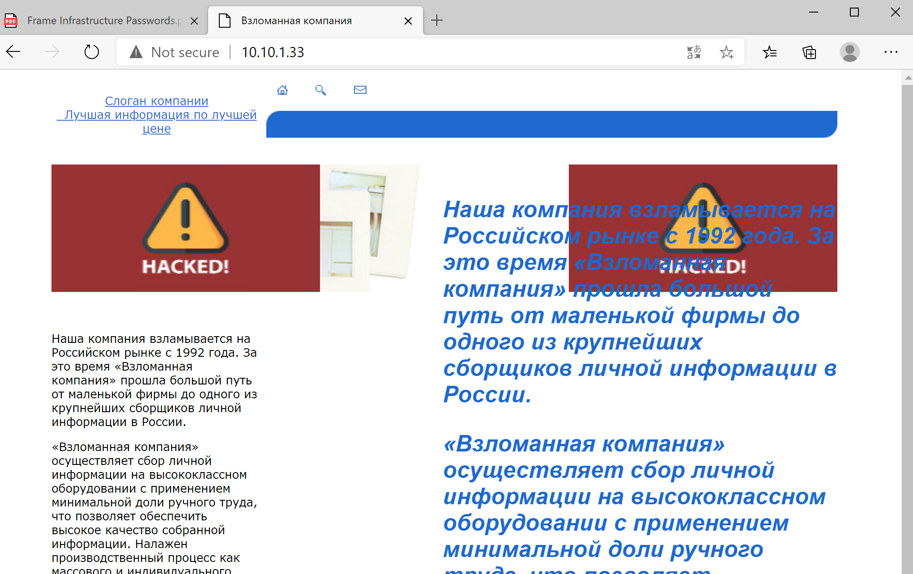{#fig-019 width=50%}

## Обнаружение последствия Deface веб-сайта

На сервере GitLab после ssh подключение к нему можем обнаружить скрипт password_recovery, код которого представляет собой сброс пароля от аккаунта администратора

{#fig-020 width=50%}

## Карточка инцидента

Заполним карточку инцидента.

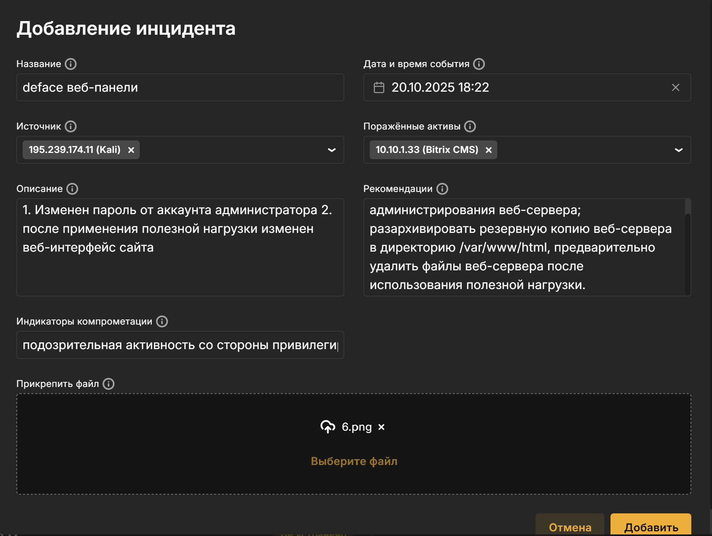{#fig-021 width=50%}

## Проверка последствия Data encryption

На сервере Bitrix используется база данных MySQL, проверить состояние можно с помощью команды systemctl status mysql, видим, что MySQL активна.

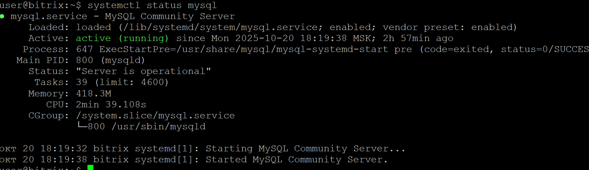{#fig-022 width=50%}

## Проверка последствия Data encryption

Входим в директорию с базой данных /var/lib/mysql/sitemanage. Последствие data encryption **не обнаружено**

{#fig-023 width=50%}

## Проверка последствия Crontab backdoor

В системных логах **не обнаружено**, что задача с расположением файла /root/evil.conf выполняется каждую минуту пользователем root

{#fig-024 width=50%}

## Проверка последствия Crontab backdoor

В системных логах **не обнаружено**, что задача с расположением файла /root/evil.conf выполняется каждую минуту пользователем root

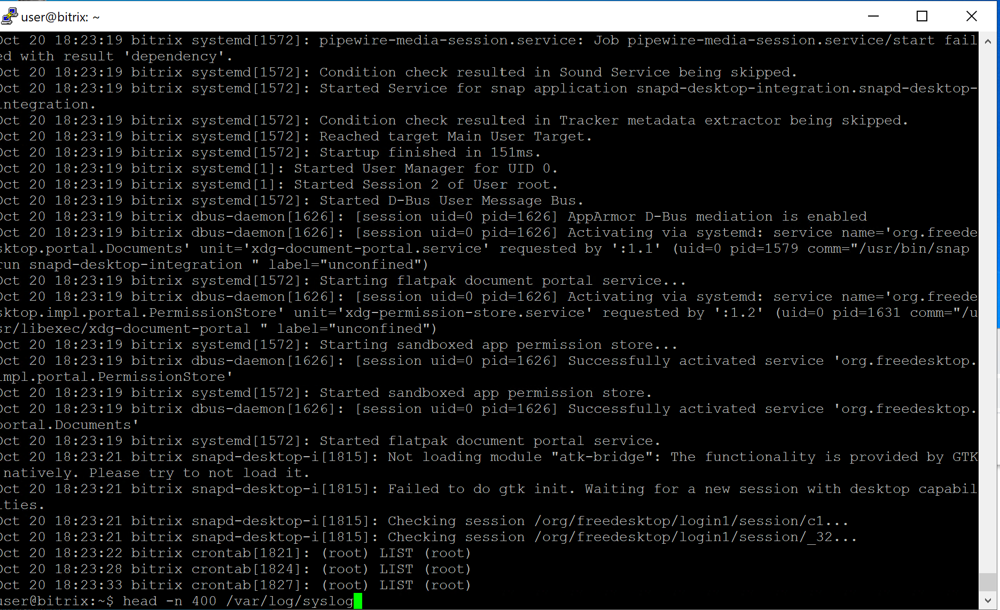{#fig-025 width=50%}

## Проверка последствия Linux

Также среди пользователей Linux не было обнаружено новых недавно созданных учетных записей, тем более со странными названиями типа hacker.

## Обнаружение уязвимости CVE-2021-22204 (GitLab)

Для данной уязвимости в ViPNet IDS NS установлено правило, которое обнаруживает в сетевом трафике программный код, предназначенный для эксплуатации уязвимости AM EXPLOIT GitLab CE/EE 11.9-13.10.3 Unauthenticated Remote ExifTool Command Injection (CVE-2021-22205).

{#fig-106 width=50%}

## Обнаружение уязвимости CVE-2021-22204 (GitLab)

Для данной уязвимости в ViPNet IDS NS установлено правило, которое обнаруживает в сетевом трафике программный код, предназначенный для эксплуатации уязвимости AM EXPLOIT GitLab CE/EE 11.9-13.10.3 Unauthenticated Remote ExifTool Command Injection (CVE-2021-22205).

{#fig-107 width=50%}

## Обнаружение уязвимости CVE-2021-22204 (GitLab)

После создания аккаунта и файла с полезной нагрузкой нарушитель будет производить POST-запрос с определенными параметрами

{#fig-005 width=50%}

## Карточка инцидента

Добавляем инцидент

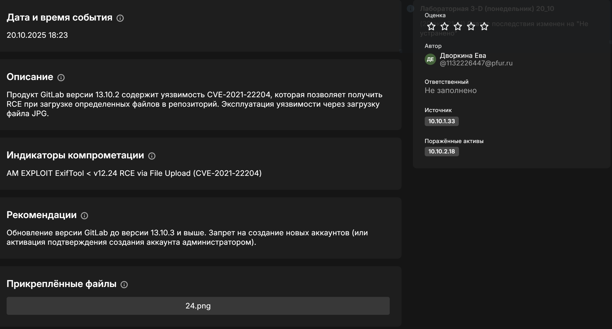{#fig-007 width=50%}

## Проверка последствия Deleter

Интерфейс страницы репозитория до изменений представлен на скриншоте, после изменений он становится пустым. То есть, это последствие не обнаружено.

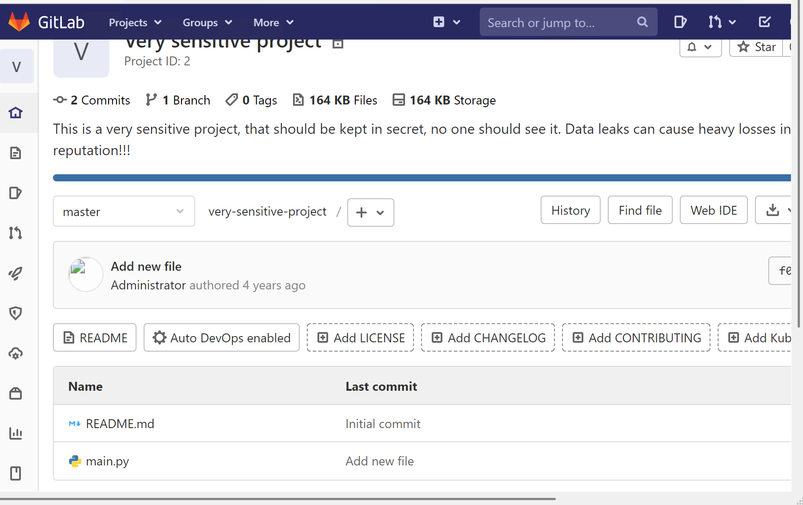{#fig-026 width=50%}

## Проверка последствия Dump базы данных.

Эта полезная нагрузка заключалась бы в создании нарушетелем резервной копии базы данных, однако, при проверке, резервной копии от нарушителя обнаружено не было.

{#fig-108 width=50%}

## Meterpreter-сессия (GitLab)

Проверяем с помощью утилиты ss с ключами t и p. В случае установления соединения на уязвимой машине появится сокет с машиной нарушителя

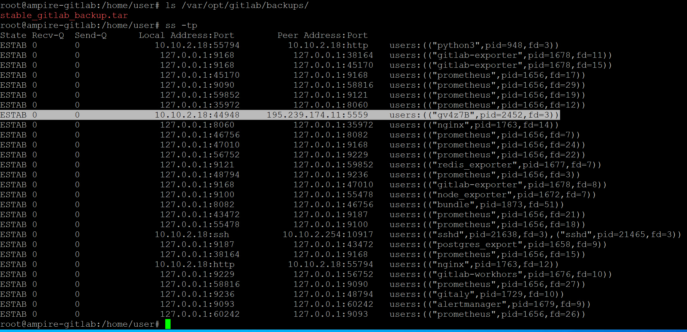{#fig-027 width=50%}

## Добавляем инцидент

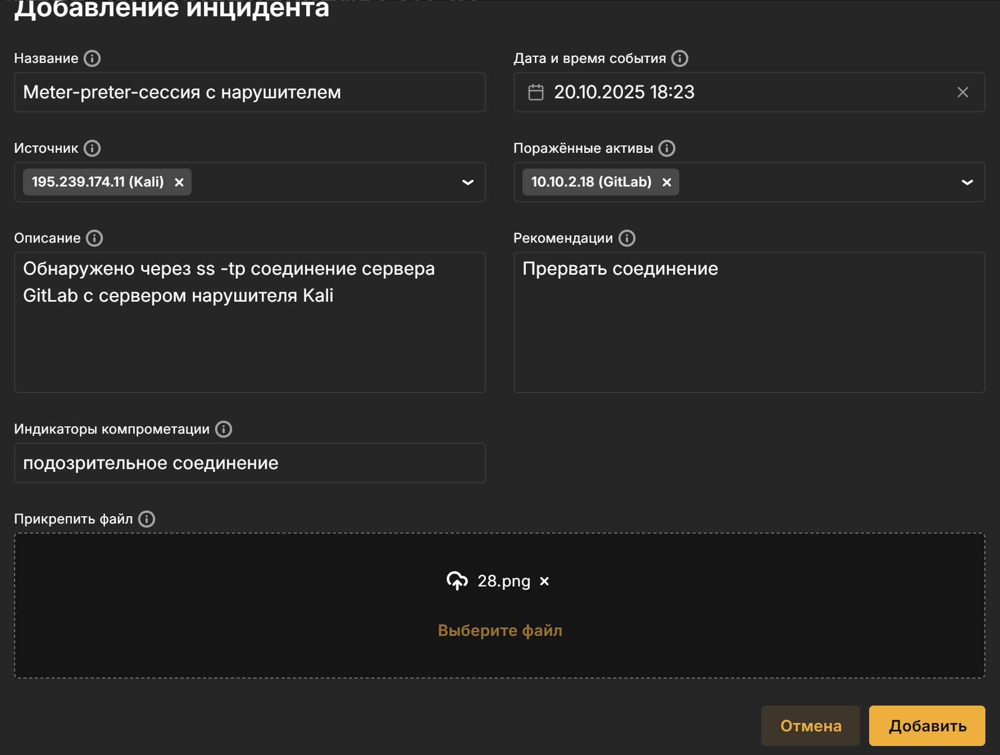{#fig-109 width=50%}

## Обнаружение уязвимости CVE-2022-29464 (WSO2 API Manager)

:::::::::::::: {.columns align=center}
::: {.column width="40%"}

Специфическое правило, идентифицированное как ET POLICY Executable and linking format (ELF) file download, выявляет потенциально рискованную активность, связанную с загрузкой файлов в формате ELF.

{#fig-011 width=50%}

:::
::: {.column width="60%"}

{#fig-110 width=50%}

:::
::::::::::::::

## Обнаружение уязвимости CVE-2022-29464 (WSO2 API Manager)

При скачивании пакета события и рассмотрении подробнее можно выявить факт загрузки вредоносного JSP файла на сервер 

{#fig-111 width=50%}

## Обнаружение уязвимости CVE-2022-29464 (WSO2 API Manager)

При скачивании пакета события и рассмотрении подробнее можно выявить факт загрузки вредоносного JSP файла на сервер

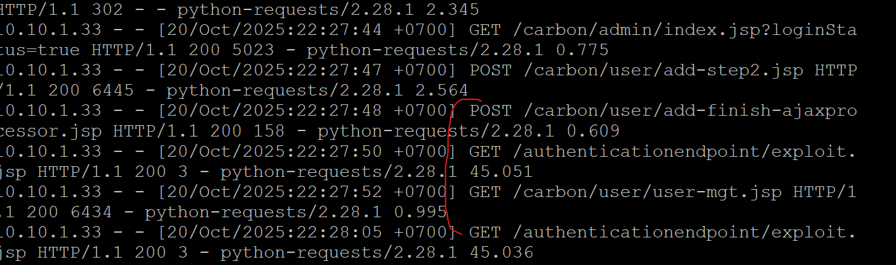{#fig-008 width=50%}

## Обнаружение уязвимости CVE-2022-29464 (WSO2 API Manager)

Файл с полезной нагрузкой можно просмотреть в текстовом редакторе с помощью команды: nano exploit.jsp.

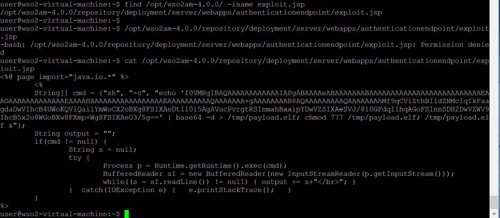{#fig-009 width=50%}

## Обнаружение уязвимости CVE-2022-29464 (WSO2 API Manager)

В результате исполнения файла payload.elf нарушитель получит активную meterpreter-сессию с машиной WSO2.

{#fig-010 width=50%}

## Карточка инцидента

Заполняем карточку инцидента.

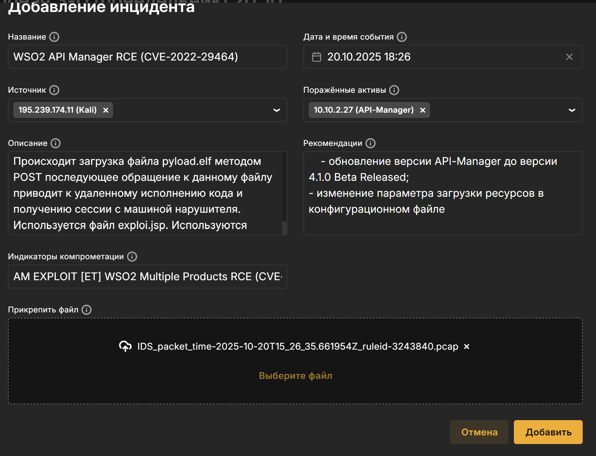{#fig-012 width=50%}

## Создание привилегированных пользователей

Обнаружен новый пользователь hacker в веб-интерфейсе.

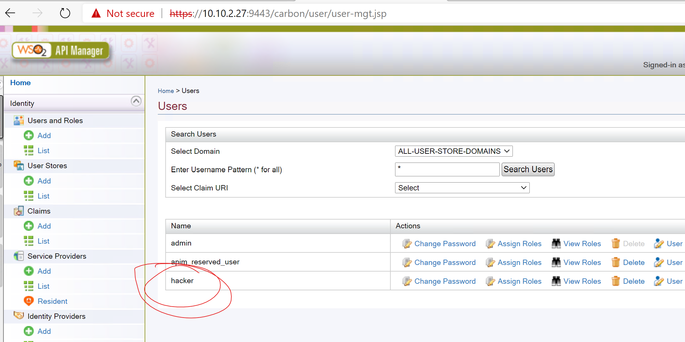{#fig-028 width=50%}

## Создание привилегированных пользователей

Обнаружен новый пользователь hacker в веб-интерфейсе.

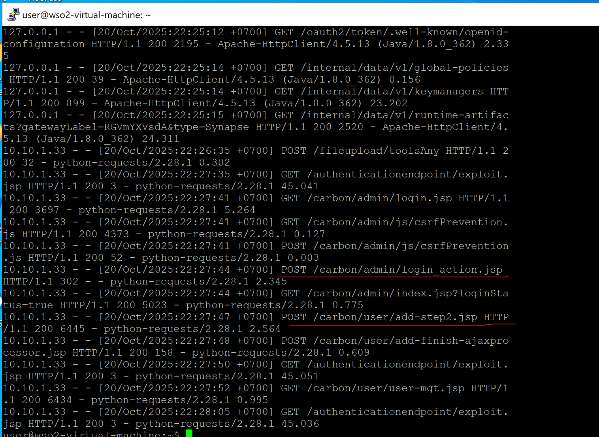{#fig-029 width=50%}

## Добавляем карточку инцидента

{#fig-112 width=50%}

# Устранение уязвимостей и их последствий

## Meterpreter bitrix vote rce

Завершены процессы, устанавливающие соединение с злоумышленником, с помощью kill PID .

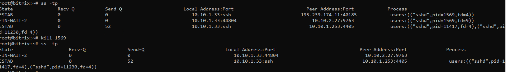{#fig-036 width=50%}

## Deface

Найдем файл для изменения пароля и меняем его.

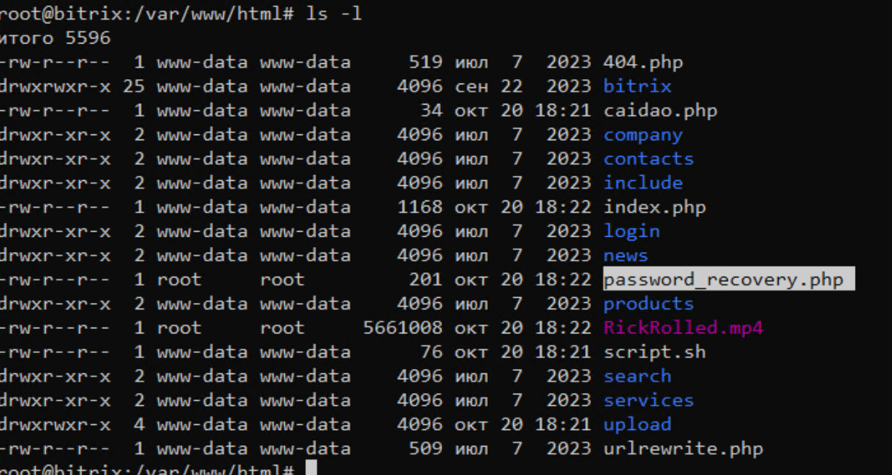{#fig-113 width=50%}

{#fig-038 width=50%}

## Deface

После захвата нового пароля из нашего файла доступ к битрикс восстановлен.

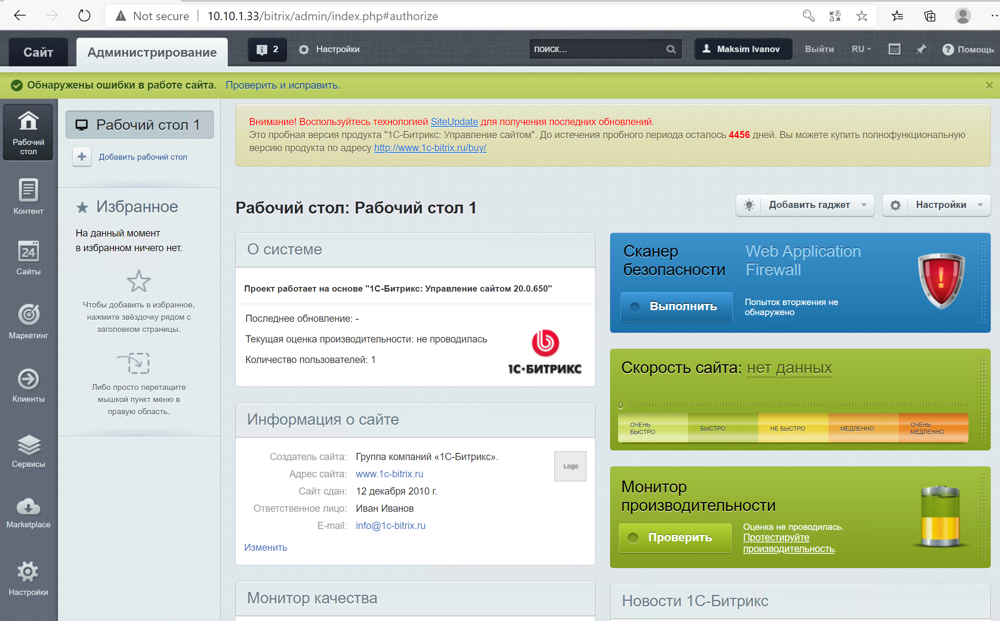{#fig-039 width=50%}

## Deface

После захвата нового пароля из нашего файла доступ к битрикс восстановлен.

{#fig-040 width=50%}

## Deface

Переходим к восстановлению сайта. Файл с резервной копией сайта находим по адресу /var/bitrix_backups/ через команду ls -la. Резервная копия скопирована. Сайт обновлен

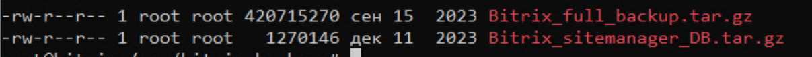{#fig-041 width=50%}

## Deface

Переходим к восстановлению сайта. Файл с резервной копией сайта находим по адресу /var/bitrix_backups/ через команду ls -la. Резервная копия скопирована. Сайт обновлен

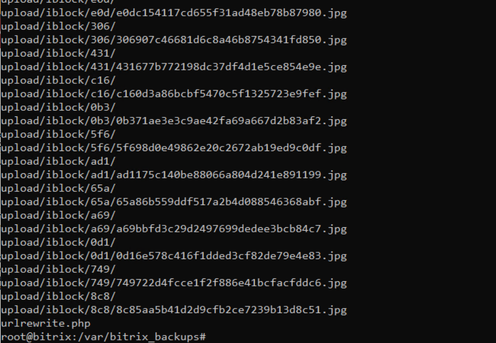{#fig-042 width=50%}

## Устранение уязвимости **CVE-2022-27228 (Bitrix):**

Для устранения LPE используются два подхода :
- удалить SUID-бит у файла /var/www/html/apache_restart с помощью команды chmod –s /var/www/html/apache_restart;
- удалить файл /var/www/html/apache_restart с помощью команды rm /var/www/html/apache_restart

{#fig-032 width=50%}

## Сайт после устраненния уязвимости и последствий 

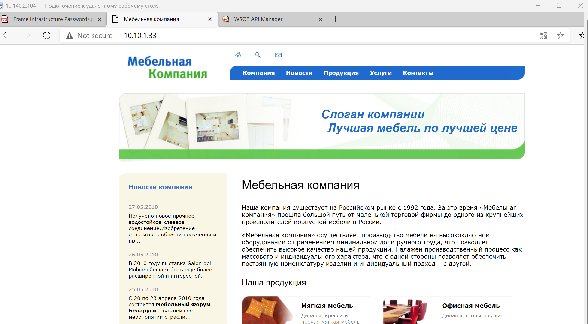{#fig-130 width=50%}

## Устранение уязвимости **CVE-2021-22204 (GitLab):**

Данную уязвимость можно устранить, обновив версию GitLab до  версии 13.10.3 и выше. Передаем файл с новой версией на машину GitLab.

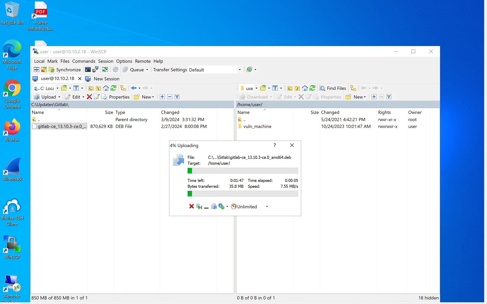{#fig-132 width=50%}

##  Устранение уязвимости **CVE-2021-22204 (GitLab):**

С помощью команды dpkg будет установлен файл обновления *.DEB .

{#fig-033 width=50%}

##  Устранение уязвимости **CVE-2021-22204 (GitLab):**

В результате обновление будет успешно установлено спустя примерно 15 минут, сервер Gitlab будет автоматически перезапущен.

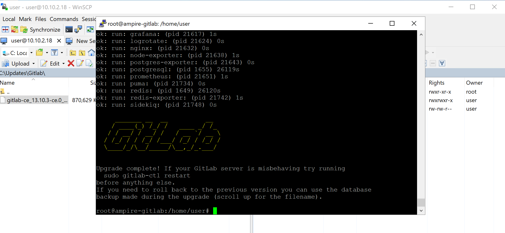{#fig-034 width=50%}

## Устранение Meterpreter-сессии (GitLab)

Снова найдем процесс, который нужно удалить .

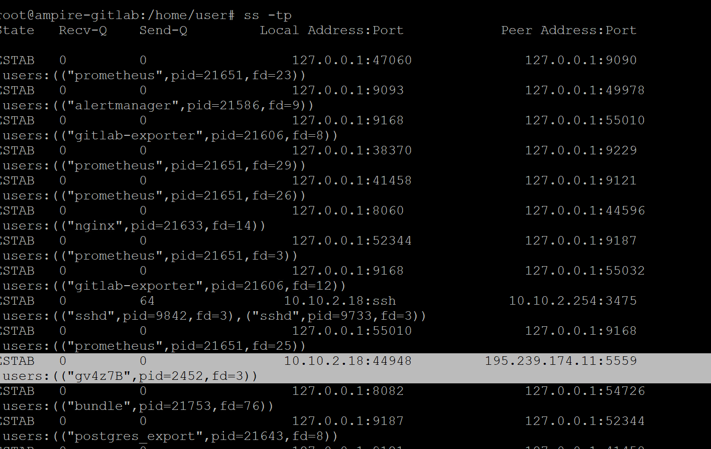{#fig-145 width=50%}

## Устранение Meterpreter-сессии (GitLab)

C помощью команды sudo kill <PID> завершаем процесс, устанавливающий соединение с хостом нарушителя .

{#fig-045 width=50%}

## Устранение уязвимости **CVE-2022-29464 (WSO2 API Manager):**

Изменяем конфигурацию, содержимое файла ([[resource.access_control]]). Перезапускаем службу и удаляем файлы explot.jsp и payload.elf

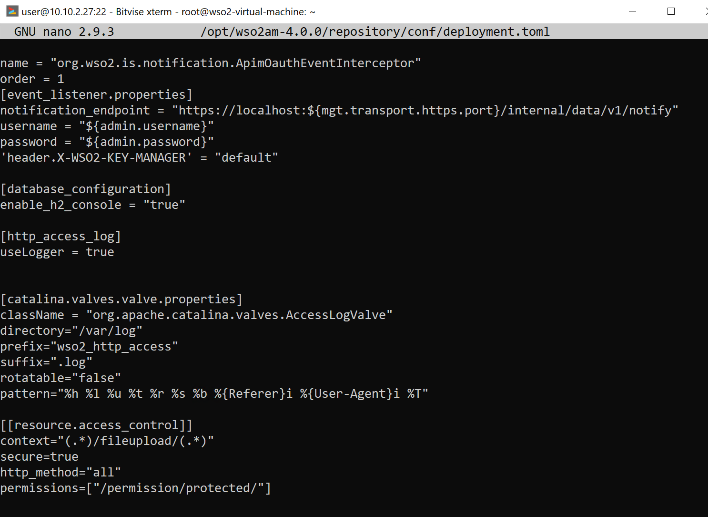{#fig-035 width=50%}

## Устранение уязвимости **CVE-2022-29464 (WSO2 API Manager):**

Изменяем конфигурацию, содержимое файла ([[resource.access_control]]). Перезапускаем службу и удаляем файлы explot.jsp и payload.elf

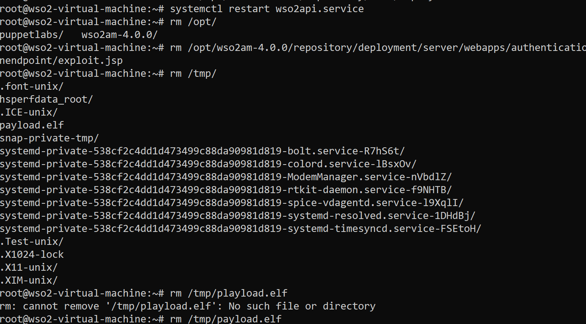{#fig-037 width=50%}

## Удаление пользователей:

Удаляем пользователя hacker.

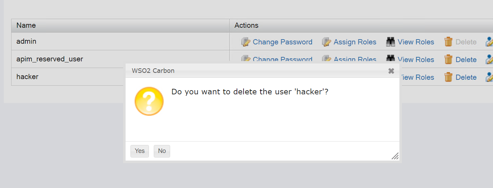{#fig-043 width=50%}

## Результат

В результате выполнения лабораторной работы были устранены все уязвимости и последствия, а также закрыты все инциденты.

{#fig-240 width=50%}

## Выводы

В ходе лабораторной работы были успешно обнаружены и устранены критические уязвимости в интеграционной платформе компании. Ликвидированы последствия атаки, включающие несанкционированный доступ, изменение содержимого сайта и нарушение целостности данных. Применены меры для предотвращения повторной эксплуатации уязвимостей.
Спасибо за внимание!

:::
