---
## Author
author:
    - Александрова У.В.,
    - Волгин И.А,
    - Голощапов Я.В.,
    - Дворкина Е.В.,
    - Серегина И.А.

## Title
title: "Отчет по лабораторной работе №3-D «ЗАЩИТА ИНТЕГРАЦИОННОЙ ПЛАТФОРМЫ»"
subtitle: "Кибербезопасность предприятия"
license: "CC BY"
---

# Цель работы

Целью данной лабораторной работы является освоение практических навыков выявления, анализа и устранения уязвимостей интеграционных платформ и веб-приложений в рамках сценария «Защита интеграционной платформы».

# Задание

- Обнаружить, проанализировать и закрыть уязвимости:

  1. Уязвимость CVE-2022-27228 в модуле vote CMS Bitrix;
  2. Уязвимость CVE-2021-22204/22205 в GitLab;
  3. Уязвимость CVE-2022-29464 в WSO2 API Manager.

- Определить и устранить последствия эксплуатации уязвимостей:

  1. Meterpreter-сессии на веб-серверах;
  2. Deface веб-сайта;
  3. Создание привилегированных пользователей;
  4. Установка backdoor через crontab;
  5. Шифрование данных.

- Разработать и применить меры по устранению выявленных уязвимостей.

# Теоретическое введение

**CVE-2022-27228** — уязвимость в модуле vote CMS Bitrix, позволяющая удаленно записывать произвольные файлы и выполнять код через небезопасную десериализацию.

**CVE-2021-22204/22205** — уязвимость в GitLab, связанная с некорректной обработкой метаданных изображений в ExifTool, приводящая к удаленному выполнению кода.

**CVE-2022-29464** — уязвимость в WSO2 API Manager, позволяющая загружать произвольные JSP-файлы без аутентификации и выполнять код на сервере.

**Meterpreter-сессия** — получение злоумышленником удаленного доступа к системе через установку полезной нагрузки.

**Deface** — изменение содержимого веб-страницы злоумышленником с целью нанесения репутационного ущерба.

**Crontab backdoor** — добавление задачи в планировщик для автоматического запуска вредоносного кода.

# Выполнение лабораторной работы

## Описание сценария

Конкуренты нанимают злоумышленника для нанесения репутационного вреда компании. Нарушитель:

1. Обнаруживает веб-сайт компании и эксплуатирует уязвимость CVE-2022-27228 в Bitrix для загрузки веб-шелла и получения доступа к серверу.
2. Через скомпрометированный веб-сервер перемещается внутрь сети, находит уязвимый GitLab и эксплуатирует CVE-2021-22204 для выполнения кода.
3. Получает доступ к WSO2 API Manager через уязвимость CVE-2022-29464, загружает JSP-шелл и устанавливает соединение с управляющим сервером.
4. Выполняет различные вредоносные действия: дефейс сайта, шифрование данных, создание пользователей, установку бэкдоров.

## Обнаружение уязвимостей

### Обнаружение уязвимости CVE-2022-27228 (Bitrix)

В логах `/var/log/apache2/access.log` обнаружено следующее ([рис. @fig-001]).

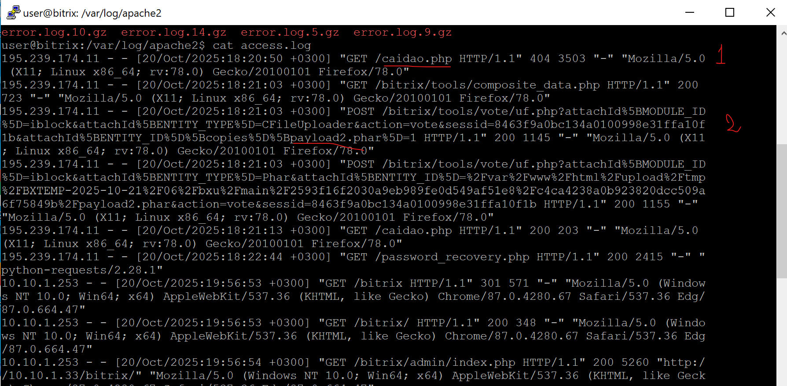{#fig-001 width=70%}

На скриншоте ([рис. @fig-001]) отображается полезная нагрузка. Если 
произвести поиск по данному названию с помощью команды find 
/var/www/html/ -iname «payload2.phar» (из директории веб-сервера, по умолчанию /var/www/html), то можно найти данный файл (1) ([рис. @fig-002]).
При просмотре 
содержимого данной полезной нагрузки c помощью редактора текста и 
команды vim /var/www/html/…/payload2.phar отобразится информация о 
скачивании веб-backdoor по пути /var/www/html/caidao.php (2) ([рис. @fig-002]).

{#fig-002 width=70%}

Так же можем обнаружить её с помощью VipNet IDS NS ([рис. @fig-003]).

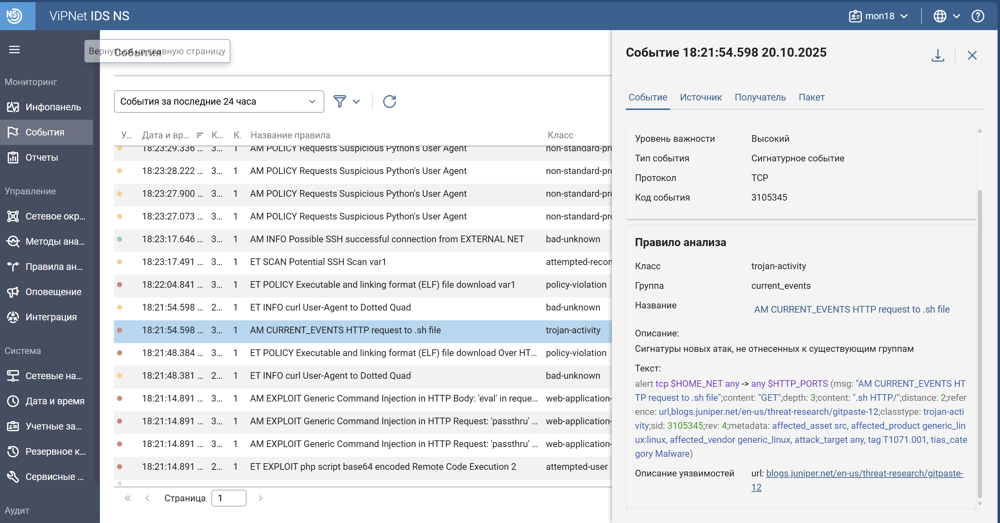{#fig-003 width=70%}

### Карточка инцидента

Добавляем карточку инцидента ([рис. @fig-004]).

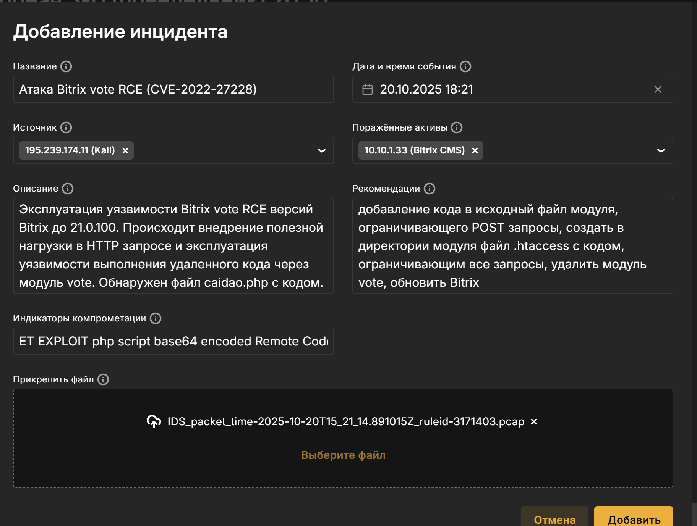{#fig-004 width=70%}

### Обнаружение уязвимости CVE-2021-22204 (GitLab)

После создания аккаунта и файла с полезной нагрузкой нарушитель 
будет производить POST-запрос с определенными параметрами по ссылке 
http://ip-address/gitlab/uploads/user/authorize для загрузки файла. 

Ищем это в лагах gitlab по пути /var/log/gitlab/gitlab-rails/production_json.log ([рис. @fig-005]).

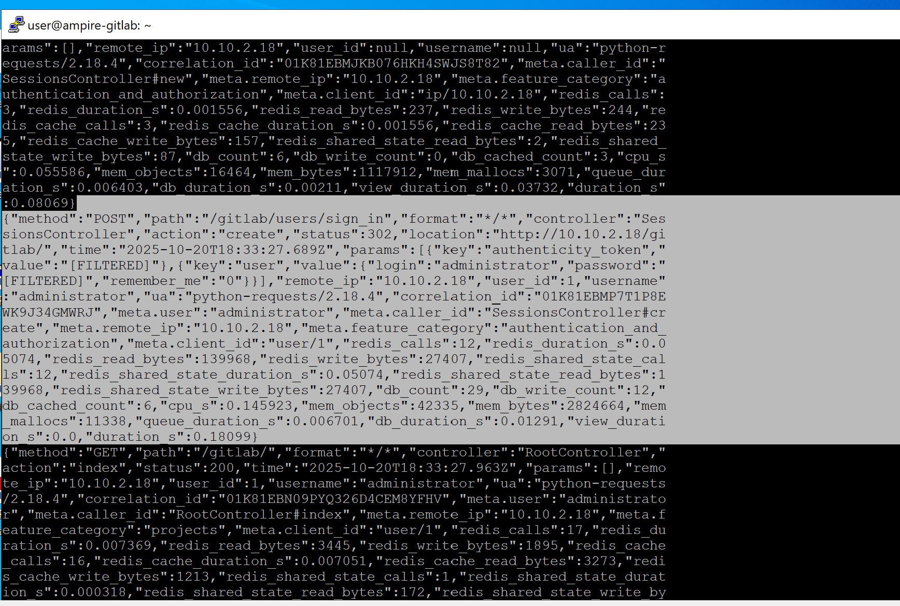{#fig-005 width=70%}

Так же можем обнаружить её с помощью VipNet IDS NS ([рис. @fig-006]).

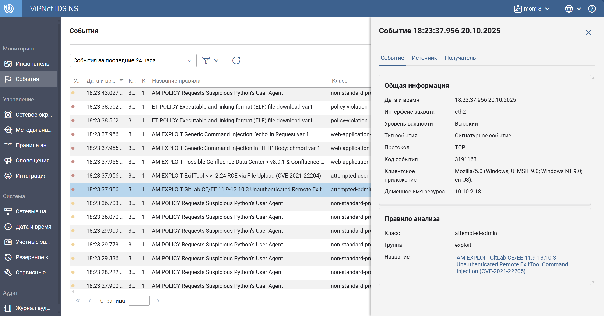{#fig-006 width=70%}

Добавляем событие ([рис. @fig-007]).

{#fig-007 width=70%}

### Обнаружение уязвимости CVE-2022-29464 (WSO2 API Manager)

Уязвимость позволяет загружать произвольные JSP-файлы на сервер без 
проверки подлинности с последующим удаленным выполнением кода. 
Обнаружение эксплуатации можно осуществить проверкой наличия в логах 
/var/log/wso2_http_access.log сообщения о загрузке файла. Просмотреть журнал событий можно с помощью команды: cat /var/log/wso2_http_access.log 

В данном журнале отображена запись о загрузке файла методом POST, 
последующее обращение к данному файлу приводит к удаленному 
исполнению кода и получению сессии с машиной нарушителя. В связи с 
нахождением данного узла в зоне Data Center IP-адрес машины, с которой 
проходят вредоносные запросы, будет соответствовать IP-адресу машины в 
зоне DMZ, который первый в цепочки атаки ([рис. @fig-008]).

{#fig-008 width=70%}

Файл с полезной нагрузкой можно просмотреть в текстовом редакторе с 
помощью команды: nano exploit.jsp 
В данном файле отображена информация о создании файла payload.elf, который будет использоваться для получения сессии с машиной нарушителя ([рис. @fig-009]).

{#fig-009 width=70%}

В результате исполнения файла payload.elf нарушитель получит 
активную meterpreter-сессию с машиной WSO2. Данную сессию можно 
отследить с помощью команды: ss –tp 
Отображено, что сессии соответствует процесс запуска файла payload.elf и PID данного файла ([рис. @fig-010]).

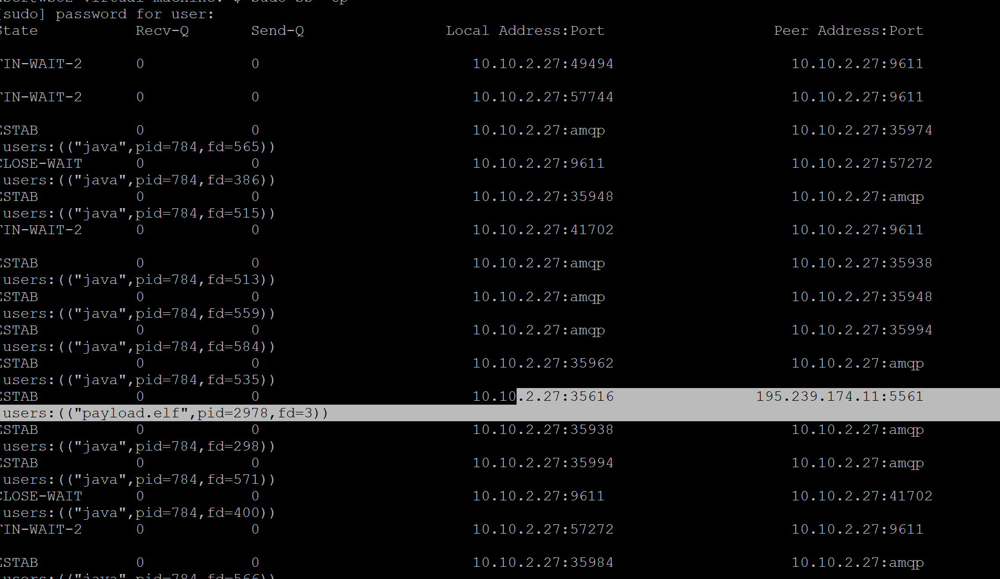{#fig-010 width=70%}

Обнаружение средствами ViPNet IDS NS ([рис. @fig-011]).

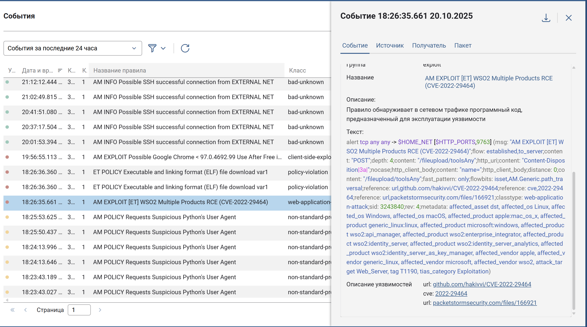{#fig-011 width=70%}

Добавляем карточку инцидента ([рис. @fig-012]).

{#fig-012 width=70%}


## Обнаружение последствий

### Обнаружение Meterpreter-сессии с узлом Bitrix CMS

Для обнаружения повышения привилегий необходимо просмотреть 
наличие сокетов с машиной нарушителя с помощью команды ss -tp ([рис. @fig-013]).

{#fig-013 width=70%}

На скриншоте ([рис. @fig-014]) отображено, что с машиной нарушителя 
195.239.174.11 установлено две сессии, в создании сессий задействованы 
файлы systemctl и apache_restart. Родительским процессом для одной из сессий является веб-сервер apache2, в связи с чем необходимо произвести 
поиск данных файлов в директории веб-сервера /var/www/html/

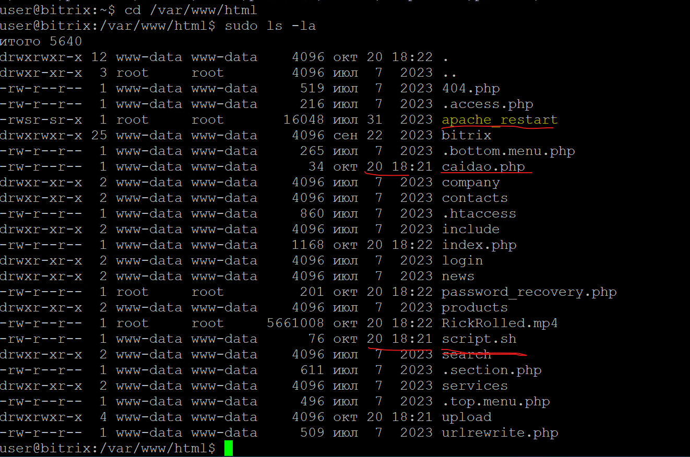{#fig-014 width=70%}

При просмотре содержимого директории веб-сервера обнаружены следующие файлы: 
- файл apache_restart – родительский для одного из сокетов с 
машиной нарушителя, у данного файла имеется SUID-бит; 
- известный веб-backdoor caidao.php; 
- файл script.sh ([рис. @fig-015]).

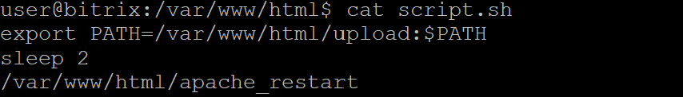{#fig-015 width=70%}

При просмотре содержимого скрипта script.sh обнаружено, что данный файл задает переменное окружение на директорию /var/www/html/upload, исполняет файл apache_restart. 
Файл apache_restart скомпилированный, но при прочтении видны выделенные цветом строчки ([рис. @fig-016]).

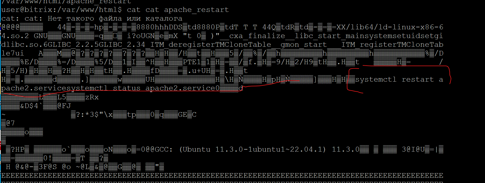{#fig-016 width=70%}

При просмотре содержимого файла apache_restart обнаружено, что данный файл использует относительный вызов системной программы systemctl. Если просмотреть содержимое директории 
/var/www/html/upload, в которую указанный скрипт задает переменную 
среду PATH ([рис. @fig-017]), то в данной среде можно обнаружить исполняемый 
файл systemctl, с помощью которого установлено соединение с машиной нарушителя. 

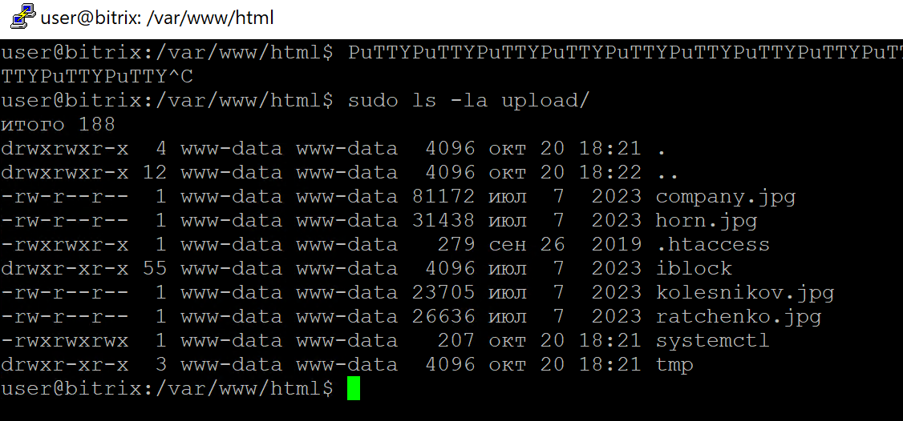{#fig-017 width=70%}

Добавляем карточку инцидента ([рис. @fig-018]).

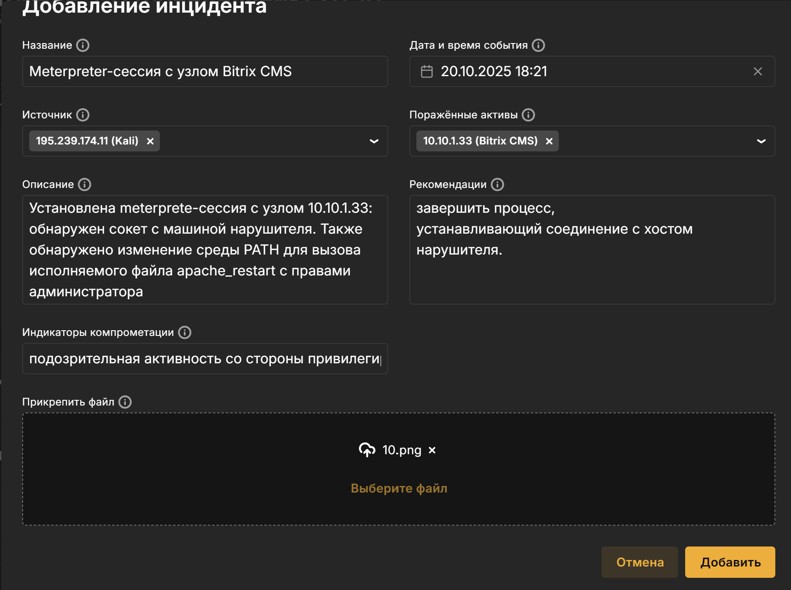{#fig-018 width=70%}


### Deface веб-сайта

Для обнаружения эксплуатации уязвимости необходимо зайти в 
браузере на сайт компании, видим, что она взломана ([рис. @fig-019]).

{#fig-019 width=70%}

Также можем обнаружить скрипт password_recovery ([рис. @fig-020]).

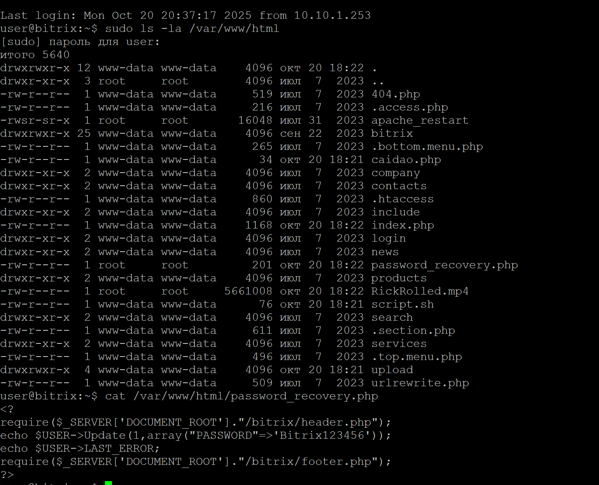{#fig-020 width=70%}

Добавляем карточку инцидента ([рис. @fig-021]).

{#fig-021 width=70%}

### Data encryption

На сервере Bitrix используется база данных MySQL, проверить состояние можно с помощью команды systemctl status mysql ([рис. @fig-022]).

{#fig-022 width=70%}

При попытке входа в директорию с базой данных /var/lib/mysql/sitemanager в 
базе обнаружены все файлы, которые зашифрованы ([рис. @fig-023]).

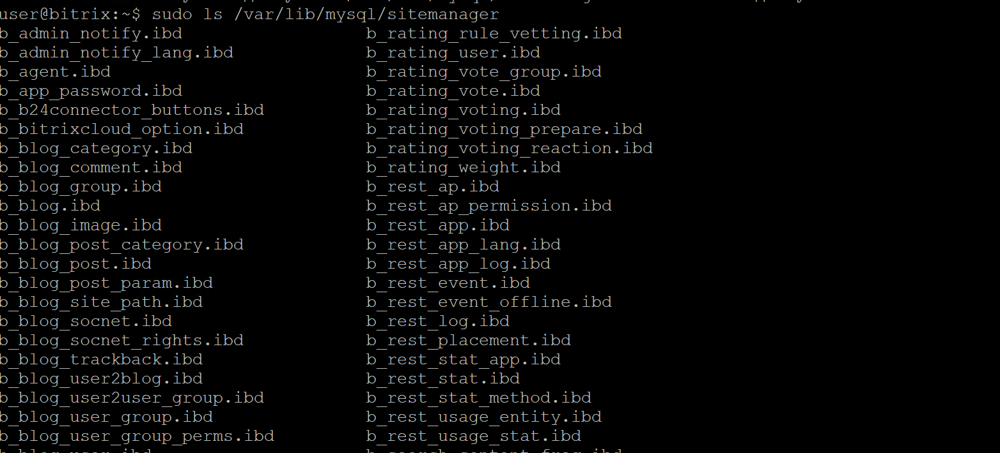{#fig-023 width=70%}

### Deleter 

Интерфейс страницы репозитория до изменений представлен на скриншоте ([рис. @fig-024]), после изменений он становится пустым.

{#fig-024 width=70%}

### Meterpreter-сессия (GitLab)

### Создание привилегированных пользователей

Обнаружен новый пользователь hacker ([рис. @fig-025]).

{#fig-025 width=70%}

Создание пользователя можно отследить и через журнал событий, расположенного по пути /var/log/wso2_http_access.log ([рис. @fig-026]).

{#fig-026 width=70%}


### Обнаружение Meterpreter-сессии с нарушителем

Выполняем команду ss -tp для обнаружения активных 
соединений ([рис. @fig-027]).

{#fig-027 width=70%}

Добавляем карточку инцидента ([рис. @fig-028]).

{#fig-028 width=70%}


## Устранение уязвимостей и их последствий

### Устранение уязвимостей

**CVE-2022-27228 (Bitrix):**

Изменяем файл для устранеия уязвимости, используя код ниже:

```php
if ($_SERVER['REQUEST_METHOD'] === 'POST') {
    header('Status: 404 Not Found');
    die();
}
```

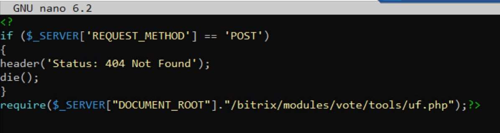{#fig-029 width=70%}


**CVE-2021-22204 (GitLab):**

Данную уязвимость можно устранить, обновив версию GitLab до  версии 13.10.3 и выше

После подключения к серверу Gitlab по протоколу SSH необходимо получить привилегии sudo-пользователя. 
Для обновления до версии 13.10.3 следует перейти в папку нахождения файла обновления и выполнить команду: sudo dpkg -i «название файла_обновления» 
С помощью команды dpkg будет установлен файл обновления *.DEB ([рис. @fig-030]).

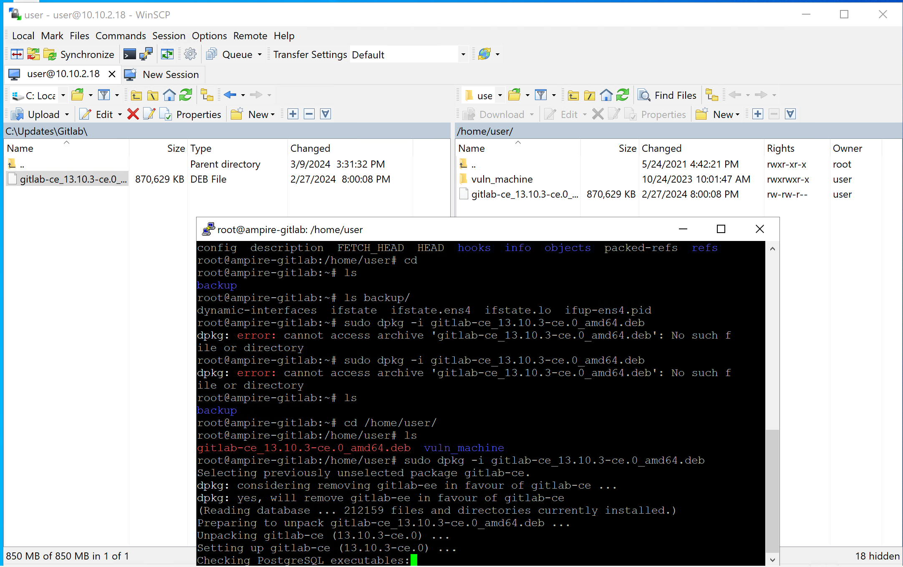{#fig-030 width=70%}

В результате обновление будет успешно установлено, сервер Gitlab 
будет автоматически перезапущен ([рис. @fig-031]).

{#fig-031 width=70%}

**CVE-2022-29464 (WSO2 API Manager):**

Изменяем конфигурацию, содержимое файла ([[resource.access_control]]) ([рис. @fig-032]).

{#fig-032 width=70%}


## Устранение последствий

### Meterpreter bitrix vote rce

Завершены процессы, устанавливающие соединение с злоумышленником, с помощью kill PID  ([рис. @fig-033]).

{#fig-033 width=70%}

Перезапускаем службу и удаляем файлы explot.jsp и payload.elf ([рис. @fig-034]).

{#fig-034 width=70%}


### Deface:

Меняем пароль на qwe123!@# в фале для восстановления пароля (с которым далее мы будем обновлять измененный пароль от сайта) ([рис. @fig-035]).

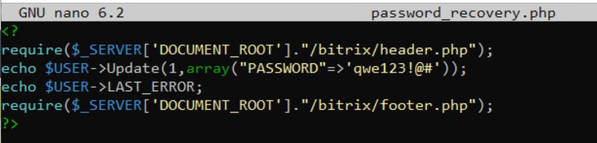{#fig-035 width=70%}

После захвата нового пароля из нашего файла доступ к битрикс восстановлен ([рис. @fig-036]).

{#fig-036 width=70%}

После восстановления доступа удаляем файл ([рис. @fig-037]).

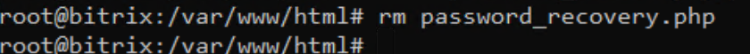{#fig-037 width=70%}

Файл с резервной копией сайта ([рис. @fig-038]).

{#fig-038 width=70%}

Копируем резервную версию сайта с помощью ([рис. @fig-039]).

```

 tar xvzf /var/bitrix_backups/Bitrix_full_backup.tar.gz -C /var/www/html
```

{#fig-039 width=70%}


### Удаление пользователей:

Удаляем пользователя hacker ([рис. @fig-040]).

{#fig-040 width=70%}

### Устранение Deleter

Для нейтрализации данной полезной нагрузки необходимо восстановить GitLab из резервной копии файла stable_gitlab_backup.tar, который  находится по пути /var/opt/gitlab/backups/stable_gitlab_backup.tar. 
Для восстановления необходимо: 
-  подключиться к машине с уязвимым сервером по протоколу SSH и 
перейти в директорию с резервными копиями /var/opt/gitlab/backups/; 
-  получить права sudo-пользователя; 
-  остановить процессы GitLab с помощью команды sudo gitlab-ctl stop puma && gitlab-ctl stop sidekq ([рис. @fig-041]).

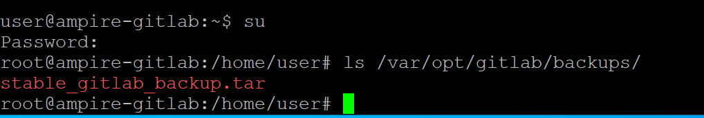{#fig-041 width=70%}


# Выводы

В ходе лабораторной работы были успешно обнаружены и устранены критические уязвимости в интеграционной платформе компании. Ликвидированы последствия атаки, включающие несанкционированный доступ, изменение содержимого сайта и нарушение целостности данных. Применены меры для предотвращения повторной эксплуатации уязвимостей.

# Список литературы{.unnumbered}

::: {#refs}
:::
