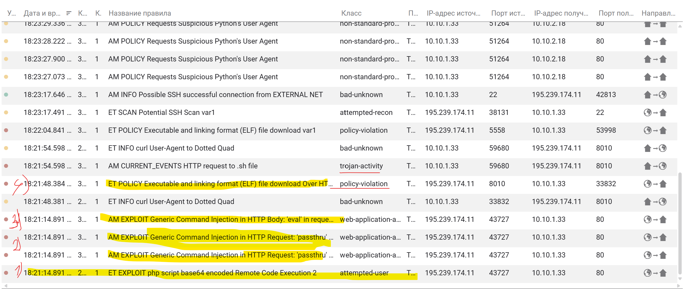
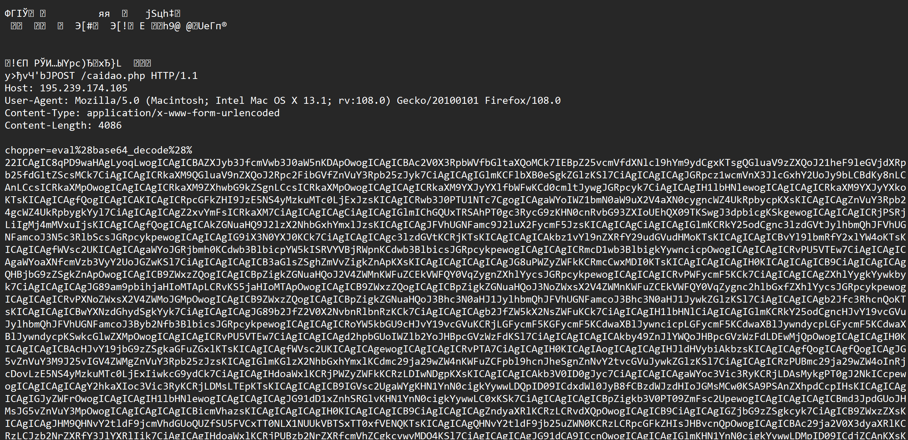
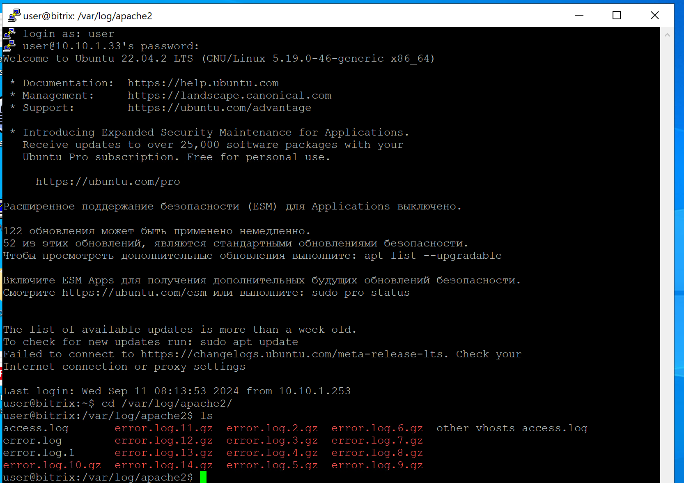
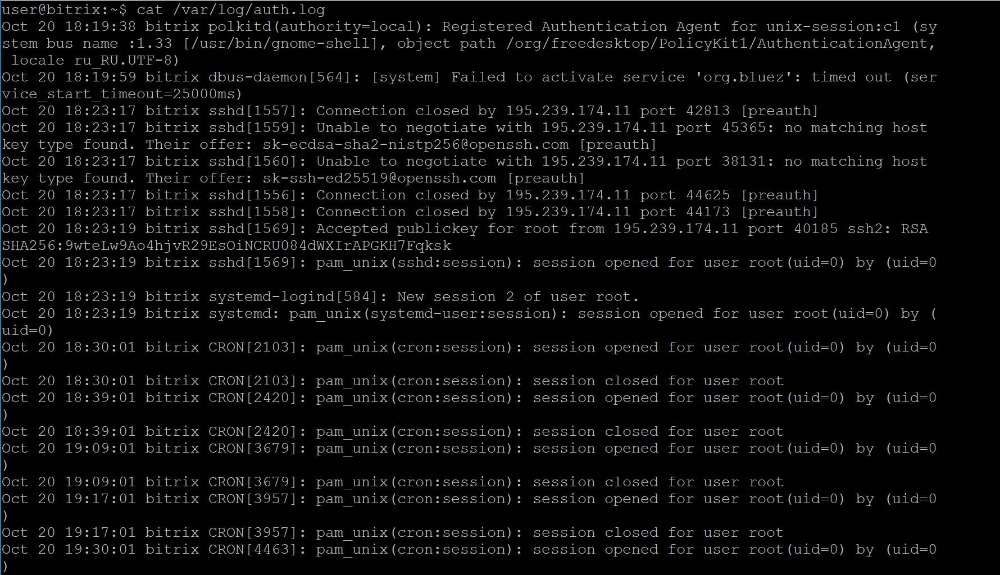
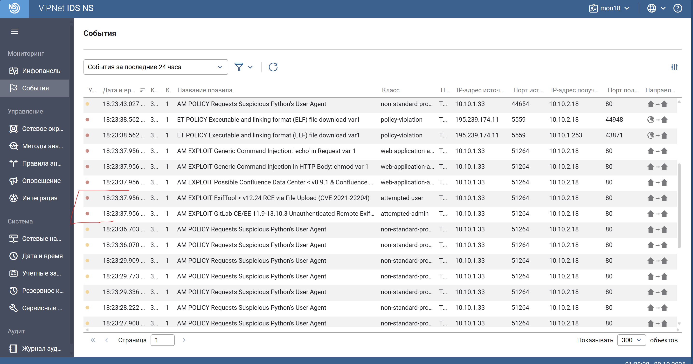
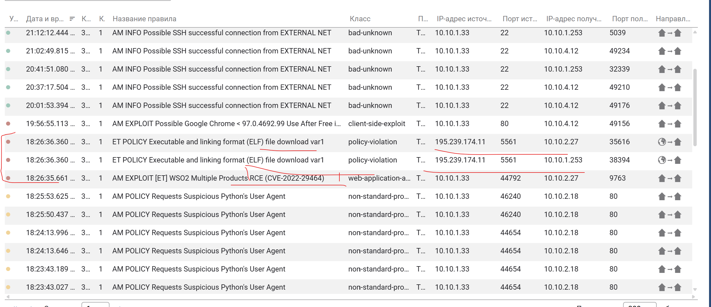
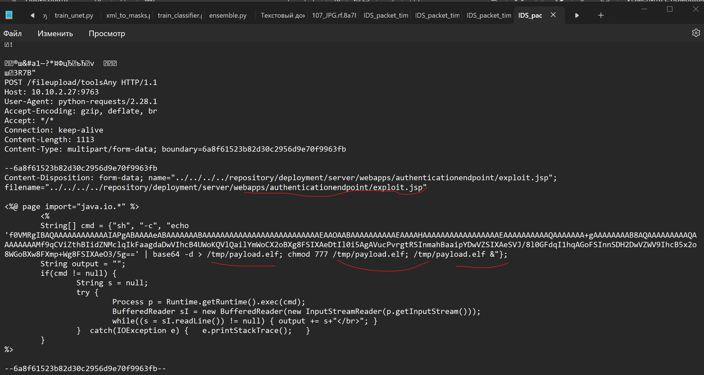
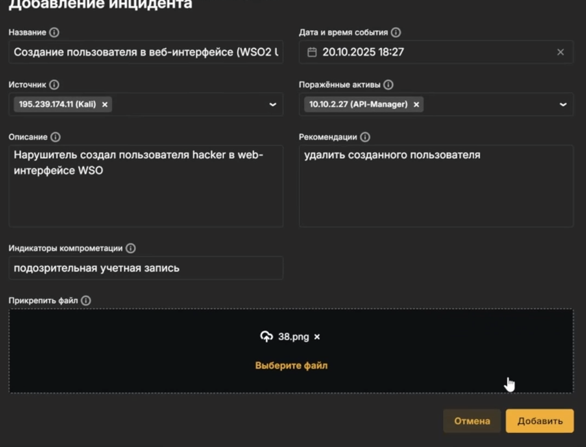
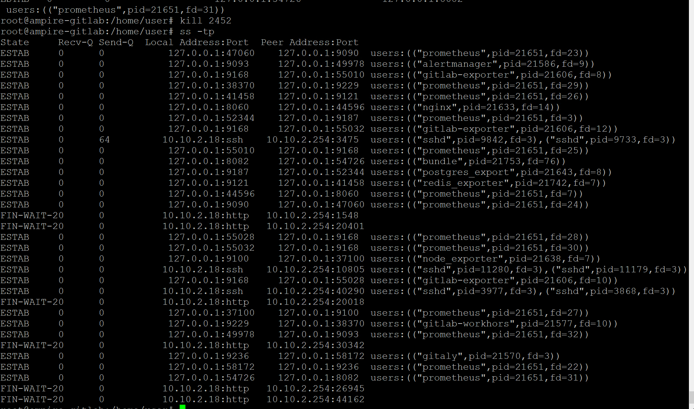
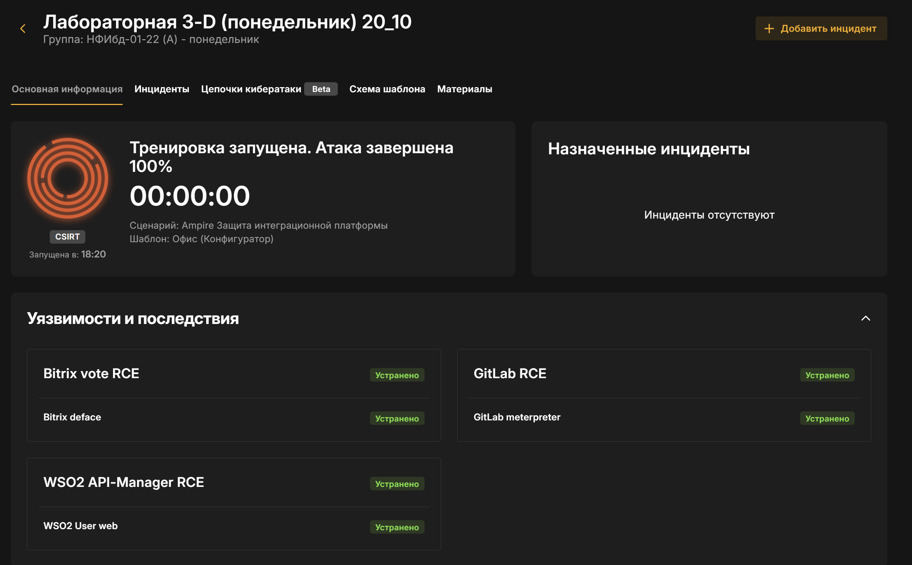

---
## Author
author:
    - Александрова У.В.,
    - Волгин И.А,
    - Голощапов Я.В.,
    - Дворкина Е.В.,
    - Серегина И.А.

## Title
title: "Отчет по лабораторной работе №3-D «ЗАЩИТА ИНТЕГРАЦИОННОЙ ПЛАТФОРМЫ»"
subtitle: "Кибербезопасность предприятия"
license: "CC BY"
---

# Цель работы

Целью данной лабораторной работы является освоение практических навыков выявления, анализа и устранения уязвимостей интеграционных платформ и веб-приложений в рамках сценария «Защита интеграционной платформы».

# Задание

- Обнаружить, проанализировать и закрыть уязвимости:

  1. Уязвимость CVE-2022-27228 - Bitrix vote CMS Bitrix;
  2. Уязвимость CVE-2021-22204/22205 - GitLab RCE;
  3. Уязвимость CVE-2022-29464 - WSO2 API Manager RCE.

- Определить и устранить последствия эксплуатации уязвимостей:

  1. Deface веб-панели;
  2. Meterpreter-сессия на сервере GitLab;
  3. WSO2 User Web - создание пользователя в веб-панели.

- Разработать и применить меры по устранению выявленных уязвимостей.

# Теоретическое введение

**CVE-2022-27228** — уязвимость в модуле vote CMS Bitrix, позволяющая удаленно записывать произвольные файлы и выполнять код через небезопасную десериализацию [@bitrix].

**CVE-2021-22204/22205** — уязвимость в GitLab, связанная с некорректной обработкой метаданных изображений в ExifTool, приводящая к удаленному выполнению кода [@gitlab].

**CVE-2022-29464** — уязвимость в WSO2 API Manager, позволяющая загружать произвольные JSP-файлы без аутентификации и выполнять код на сервере [@wso].

**Meterpreter-сессия** — получение злоумышленником удаленного доступа к системе через установку полезной нагрузки [@bitrix].

**Deface** — изменение содержимого веб-страницы злоумышленником с целью нанесения репутационного ущерба [@bitrix].

# Выполнение лабораторной работы

## Описание сценария

Конкуренты нанимают злоумышленника для нанесения репутационного вреда компании. Нарушитель:

1. Обнаруживает веб-сайт компании и эксплуатирует уязвимость CVE-2022-27228 в Bitrix для загрузки веб-шелла и получения доступа к серверу.
2. Через скомпрометированный веб-сервер перемещается внутрь сети, находит уязвимый GitLab и эксплуатирует CVE-2021-22204 для выполнения кода.
3. Получает доступ к WSO2 API Manager через уязвимость CVE-2022-29464, загружает JSP-шелл и устанавливает соединение с управляющим сервером.
4. Выполняет различные вредоносные действия: дефейс сайта, шифрование данных, создание пользователей, установку бэкдоров.

## Обнаружение уязвимостей и последствий

### Обнаружение уязвимости CVE-2022-27228 (Bitrix)

Рассмотрим средство обнаружения уязвимостей VipNet IDS:

При просмотре записей журнала событий ([рис. @fig:101]) обнаружено, что IP-адрес:

- 195.239.174.11 – принадлежит машине атакующего;
- 10.10.1.33 – принадлежит уязвимому серверу Bitrix.

Среди записей журнала зарегистрированы события информационной
безопасности высокой важности:

1) PHP-скрипт с кодом для произвольного удаленного выполнения команд.
2-3) внедрение полезной нагрузки в HTTP-запросе.
4) информирование о скачивании исполняемого файла с машины нарушителя.

{#fig-101 width=70%}

В пакете события, отвечающего за эксплуатацию PHP-скрипта с шифровкой base64, мы видим использование php-веб-шелла Caidao, он же China Chopper, используемого для удаленного управления скомпрометированного сервера. Используется метод POST, означающий отправку данных на скрипт Caidao.php. Предполагаем, что закодирован сам скрипт ([рис. @fig:102]).

{#fig-102 width=70%}

Также проверим эту уязвимость средставми ОС. Зайдем с помощью ssh подключения на машину Bitrix CMS. Нас интересует файл с логами, найдем его: access.log ([рис. @fig:103]).

{#fig-103 width=70%}

В логах `/var/log/apache2/access.log` обнаружена полезная нагрузка payload, так же видим получение данных из скрипта caidao.php. ([рис. @fig-001]).

{#fig-001 width=70%}

Если
произвести поиск по названию с помощью команды find
/var/www/html/ -iname «payload2.phar» (из директории веб-сервера, по умолчанию /var/www/html), то можно найти файл (1) ([рис. @fig-002]).
При просмотре содержимого данной полезной нагрузки c помощью команды cat /var/www/html/…/payload2.phar отобразится информация о
скачивании веб-backdoor по пути /var/www/html/caidao.php (2) ([рис. @fig-002]).

{#fig-002 width=70%}

Добавляем карточку инцидента ([рис. @fig-004]).

{#fig-004 width=70%}

### Обнаружение Meterpreter-сессии с узлом Bitrix CMS

Для обнаружения повышения привилегий необходимо просмотреть
наличие сокетов с машиной нарушителя с помощью команды ss -tp ([рис. @fig-013]).

{#fig-013 width=70%}

На скриншоте ([рис. @fig-014]) отображено, что с машиной нарушителя
195.239.174.11 установлено две сессии, в создании сессий задействованы
файлы systemctl и apache_restart. Родительским процессом для одной из сессий является веб-сервер apache2, в связи с чем необходимо произвести
поиск данных файлов в директории веб-сервера /var/www/html/

{#fig-014 width=70%}

При просмотре содержимого директории веб-сервера обнаружены следующие файлы:
- файл apache_restart – родительский для одного из сокетов с
машиной нарушителя, у данного файла имеется SUID-бит;
- известный веб-backdoor caidao.php;
- файл script.sh ([рис. @fig-015]).

{#fig-015 width=70%}

При просмотре содержимого скрипта script.sh обнаружено, что данный файл задает переменное окружение на директорию /var/www/html/upload, исполняет файл apache_restart.
Файл apache_restart скомпилированный, при прочтении видны выделенные цветом строчки ([рис. @fig-016]).

{#fig-016 width=70%}

При просмотре содержимого файла apache_restart обнаружено, что данный файл использует относительный вызов системной программы systemctl. Если просмотреть содержимое директории
/var/www/html/upload, в которую указанный скрипт задает переменную
среду PATH ([рис. @fig-017]), то в данной среде можно обнаружить исполняемый
файл systemctl, с помощью которого установлено соединение с машиной нарушителя.

{#fig-017 width=70%}

Добавляем карточку инцидента ([рис. @fig-018]).

{#fig-018 width=70%}


### Обнаружение последствия Deface веб-сайта

Для обнаружения эксплуатации уязвимости необходимо зайти в
браузере на сайт компании, видим, что она взломана и ее внешний вид изменен ([рис. @fig-019]). Также при попытке авторизации на сайте, не получается это сделать.

{#fig-019 width=70%}

На сервере GitLab после ssh подключение к нему можем обнаружить скрипт password_recovery, код которого представляет собой сброс пароля от аккаунта администратора ([рис. @fig-020]).

{#fig-020 width=70%}

Добавляем карточку инцидента ([рис. @fig-021]).

{#fig-021 width=70%}

### Проверка последствия Data encryption

На сервере Bitrix используется база данных MySQL, проверить состояние можно с помощью команды systemctl status mysql, видим, что MySQL активна ([рис. @fig-022]).

{#fig-022 width=70%}

Входим в директорию с базой данных /var/lib/mysql/sitemanage ([рис. @fig-023]).

{#fig-023 width=70%}

Последствие data encryption **не обнаружено**

### Проверка последствия Crontab backdoor

В системных логах **не обнаружено**, что задача с расположением файла /root/evil.conf выполняется каждую минуту
пользователем root ([рис. @fig-024]), ([рис. @fig-025]).

{#fig-024 width=70%}

{#fig-025 width=70%}

### Проверка последствия Linux

Также среди пользователей Linux не было обнаружено новых недавно созданных учетных записей, тем более со странными названиями типа hacker.

### Обнаружение уязвимости CVE-2021-22204 (GitLab)

Обнаружение уязвимости в сетевом трафике в ViPNet IDS NS успешно определяется с использованием метода сигнатурного анализа файлов, что приводит к регистрации инцидента информационной безопасности с высоким уровнем важности (обозначен красной меткой).

Для данной уязвимости в ViPNet IDS NS[ установлено правило, которое обнаруживает в сетевом трафике программный код, предназначенный для эксплуатации уязвимости AM EXPLOIT GitLab CE/EE 11.9-13.10.3 Unauthenticated Remote ExifTool Command Injection (CVE-2021-22205).

Следует отметить, что сущность уязвимостей под идентификаторами CVE-2021-22204 и CVE-2021-22205 фактически одинакова ([рис. @fig:106]), ([рис. @fig:107]).

{#fig-106 width=70%}

{#fig-107 width=70%}

После создания аккаунта и файла с полезной нагрузкой нарушитель 
будет производить POST-запрос с определенными параметрами по ссылке 
http://ip-address/gitlab/uploads/user/authorize для загрузки файла. 

Ищем это в лагах gitlab по пути /var/log/gitlab/gitlab-rails/production_json.log ([рис. @fig-005]).

{#fig-005 width=70%}

Добавляем инцидент ([рис. @fig-007]).

{#fig-007 width=70%}


### Проверка последствия Deleter

Интерфейс страницы репозитория до изменений представлен на скриншоте ([рис. @fig-026]), после изменений он становится пустым. То есть, это последствие не обнаружено.

{#fig-026 width=70%}

### Проверка последствия Dump базы данных.

Эта полезная нагрузка заключалась бы в создании нарушетелем резервной копии базы данных, однако, при проверке, резервной копии от нарушителя обнаружено не было ([рис. @fig-108]).

{#fig-108 width=70%}


### Meterpreter-сессия (GitLab)

Проверяем с помощью утилиты ss с ключами t и p. В случае установления соединения на уязвимой машине
появится сокет с машиной нарушителя ([рис. @fig-027]).

{#fig-027 width=70%}

Добавляем инцидент ([рис. @fig-109]).

{#fig-109 width=70%}

### Обнаружение уязвимости CVE-2022-29464 (WSO2 API Manager)

Обнаружение средствами ViPNet IDS NS.
Специфическое правило, идентифицированное как ET POLICY Executable and linking format (ELF) file download, выявляет потенциально рискованную активность, связанную с загрузкой файлов в формате ELF. Такой формат нередко используется нарушителями для отправки с их помощью полезной нагрузки. Указанный формат является стандартным для исполняемых файлов в UNIX-подобных операционных системах. Правило определено с использованием сигнатур, а также указывает направление трафика, содержание пакета и другие детали ([рис. @fig:011]), ([рис. @fig:110]).

Тег classtype: policy-violation указывает на то, что данное событие связано с нарушением политики информационной безопасности. Такие события могут указывать на активности, которые могут представлять риск для безопасности системы.


{#fig-011 width=70%}

{#fig-110 width=70%}

При скачивании пакета события и рассмотрении
подробнее можно выявить факт загрузки вредоносного JSP
файла на сервер ([рис. @fig:111]). Происходит запрос к конечной точке (.jsp) и видим фрагмент полезной нагрузки.

{#fig-111 width=70%}

Зайдем на сервер Manager API через ssh подключение. Уязвимость позволяет загружать произвольные JSP-файлы на сервер без
проверки подлинности с последующим удаленным выполнением кода. 
Обнаружение эксплуатации можно осуществить проверкой наличия в логах 
/var/log/wso2_http_access.log сообщения о загрузке файла. Просмотреть журнал событий можно с помощью команды: cat /var/log/wso2_http_access.log 

В данном журнале отображена запись о загрузке файла методом POST, 
последующее обращение к данному файлу приводит к удаленному 
исполнению кода и получению сессии с машиной нарушителя. В связи с 
нахождением данного узла в зоне Data Center IP-адрес машины, с которой 
проходят вредоносные запросы, будет соответствовать IP-адресу машины в 
зоне DMZ, который первый в цепочки атаки ([рис. @fig-008]).

{#fig-008 width=70%}

Файл с полезной нагрузкой можно просмотреть в текстовом редакторе с 
помощью команды: nano exploit.jsp 
В данном файле отображена информация о создании файла payload.elf, который будет использоваться для получения сессии с машиной нарушителя ([рис. @fig-009]).

{#fig-009 width=70%}

В результате исполнения файла payload.elf нарушитель получит 
активную meterpreter-сессию с машиной WSO2. Данную сессию можно 
отследить с помощью команды: ss –tp 
Отображено, что сессии соответствует процесс запуска файла payload.elf и PID данного файла ([рис. @fig-010]).

{#fig-010 width=70%}

Добавляем карточку инцидента ([рис. @fig-012]).

{#fig-012 width=70%}

### Создание привилегированных пользователей

Обнаружен новый пользователь hacker в веб-интерфейсе ([рис. @fig-028]).

{#fig-028 width=70%}

Создание пользователя можно отследить и через журнал событий, расположенного по пути /var/log/wso2_http_access.log ([рис. @fig-029]).

{#fig-029 width=70%}

Добавляем карточку инцидента ([рис. @fig-112]).

{#fig-112 width=70%}


## Устранение уязвимостей и их последствий

Уязвимость Bitrix RCE будет устранена только после устранения последствий!

### Meterpreter bitrix vote rce

Завершены процессы, устанавливающие соединение с злоумышленником, с помощью kill PID  ([рис. @fig-036]).

{#fig-036 width=70%}


### Deface

Найдем файл для изменения пароля. Ранее его уже находили при детектировании ([рис. @fig-113]).

{#fig-113 width=70%}

Меняем пароль на qwe123!@# в фале для восстановления пароля (с которым далее мы будем обновлять измененный пароль от сайта) ([рис. @fig-038]).

{#fig-038 width=70%}

После захвата нового пароля из нашего файла доступ к битрикс восстановлен ([рис. @fig-039]).

{#fig-039 width=70%}

После восстановления доступа удаляем файл ([рис. @fig-040]).

{#fig-040 width=70%}

Переходим к восстановлению сайта. Файл с резервной копией сайта находим по адресу /var/bitrix_backups/ через команду ls -la([рис. @fig-041]).

{#fig-041 width=70%}

Копируем резервную версию сайта с помощью ([рис. @fig-042]).

```

 tar xvzf /var/bitrix_backups/Bitrix_full_backup.tar.gz -C /var/www/html
```

{#fig-042 width=70%}

Резервная копия скопирована. Сайт обновлен

### Устранение уязвимости **CVE-2022-27228 (Bitrix):**

Для устранения LPE используются два подхода :
- удалить SUID-бит у файла /var/www/html/apache_restart с помощью команды chmod –s /var/www/html/apache_restart;
- удалить файл /var/www/html/apache_restart с помощью команды rm /var/www/html/apache_restart

Проведем оба этих действия в директории /var/www/html.

Изменяем файл /var/www/html/bitrix/tools/vote/uf.php  перед require_once для устранеия уязвимости, используя код ниже:

```php
if ($_SERVER['REQUEST_METHOD'] === 'POST') {
    header('Status: 404 Not Found');
    die();
}
```

Данный код будет отклонять все POST-запросы к файлу uf.php ([рис. @fig-032]).

{#fig-032 width=70%}

Сайт после устраненния уязвимости и последствий ([рис. @fig-130]).

{#fig-130 width=70%}

### Устранение уязвимости **CVE-2021-22204 (GitLab):**

Данную уязвимость можно устранить, обновив версию GitLab до  версии 13.10.3 и выше

У нас на рабочем столе уже подготовлена папка Updates/Gitlab, в ней находится новая версия GitLab. С помощью приложения WinSCP можно передавать файлы с одной машины на другую, что мы и сделали: передали файл с новой версией на машину GitLab ([рис. @fig-132]).

{#fig-132 width=70%}


После подключения к серверу Gitlab по протоколу SSH необходимо получить привилегии sudo-пользователя. 
Для обновления до версии 13.10.3 следует перейти в папку нахождения файла обновления и выполнить команду: sudo dpkg -i «gitlab-ce_13.10.3-ce.0_amd64.deb»

С помощью команды dpkg будет установлен файл обновления *.DEB ([рис. @fig-033]).

{#fig-033 width=70%}

В результате обновление будет успешно установлено спустя примерно 15 минут, сервер Gitlab
будет автоматически перезапущен ([рис. @fig-034]).

{#fig-034 width=70%}

### Устранение Meterpreter-сессии (GitLab)

Снова найдем процесс, который нужно удалить ([рис. @fig-145]).

{#fig-145 width=70%}

C помощью команды sudo kill <PID> завершаем процесс, устанавливающий соединение с хостом нарушителя ([рис. @fig-045]).

{#fig-045 width=70%}

### Устранение уязвимости **CVE-2022-29464 (WSO2 API Manager):**

Изменяем конфигурацию, содержимое файла ([[resource.access_control]]) [@wso_sec] ([рис. @fig-035]).

{#fig-035 width=70%}

Перезапускаем службу и удаляем файлы explot.jsp и payload.elf ([рис. @fig-037]).

{#fig-037 width=70%}

### Удаление пользователей:

Удаляем пользователя hacker ([рис. @fig-043]).

{#fig-043 width=70%}

## Результат

В результате выполнения лабораторной работы были устранены все уязвимости и последствия, а также закрыты все инциденты ([рис. @fig-240]).

{#fig-240 width=70%}

# Выводы

В ходе лабораторной работы были успешно обнаружены и устранены критические уязвимости в интеграционной платформе компании. Ликвидированы последствия атаки, включающие несанкционированный доступ, изменение содержимого сайта и нарушение целостности данных. Применены меры для предотвращения повторной эксплуатации уязвимостей.

# Список литературы{.unnumbered}

::: {#refs}
:::
