---
## Author
author:
    - Александрова У.В.,
    - Волгин И.А,
    - Голощапов Я.В.,
    - Дворкина Е.В.,
    - Серегина И.А.
## Title
title: Лабораторная работа №4-E «ЗАХВАТ СЕРВЕРА БАЗЫ ДАННЫХ»
subtitle: "Кибербезопасность предприятия"
license: CC BY
date: today
date-format: "YYYY-MM-DD" # Example: 2025-10-15
---

## Cостав команды

Александрова Ульяна Вадимовна

Волгин Иван Алексеевич

Голощапов Ярослав Вячеславович

Дворкина Ева Владимировна

Серёгина Ирина Андреевна

## Цели и задачи

Целью данной лабораторной работы является освоение практических навыков выявления, анализа и устранения уязвимостей интеграционных платформ и веб-приложений в рамках сценария «ЗАХВАТ СЕРВЕРА БАЗЫ ДАННЫХ».

Во внутреннем сегменте организации необходимо получить доступ к серверу базы данных (БД) и найти флаг в таблице БД «Flag».

# Выполнение лабораторной работы

## Описание сценария

Во внутреннем сегменте организации необходимо получить доступ к
серверу базы данных (БД) и найти флаг в таблице БД «Flag» [@lab]

Для прохождения данного сценария в первую очередь потребуется
активная meterpreter-сессия с узлом в сегменте DMZ, находящимся под
управлением ОС семейства Linux. Это необходимо для выполнения bush
скрипта.

## Получение meterpreter-сессии

Подключаемся к kali. Настроим RDP на клиенте:
Во вкладке «Взаимодействие» указали скорость соединения, для повышения производительности, «Локальная сеть (10 Мбит/c и выше)» и нажали «Подключить».

:::::::::::::: {.columns align=center}
::: {.column width="45%"}

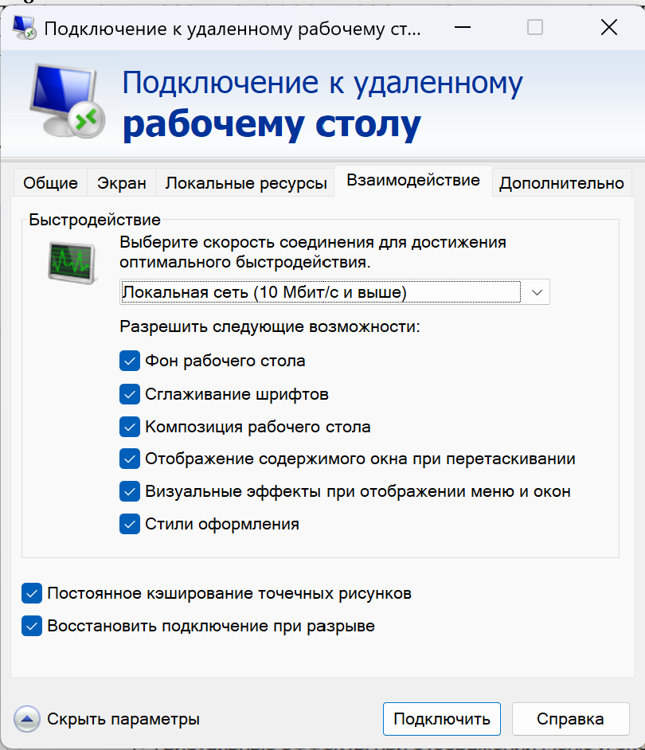{#fig-021 width=70%}

:::
::: {.column width="45%"}

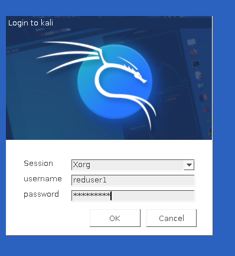{#fig-022 width=70%}

:::
::::::::::::::

## Получение meterpreter-сессии

:::::::::::::: {.columns align=center}
::: {.column width="55%"}

Все дальнейшее выполнение лабораторной работы должно проходить под учетной записью администратора, поэтому сразу перейдем в него с помощью команды su.

:::
::: {.column width="35%"}

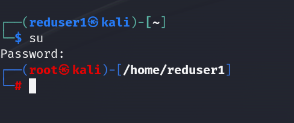{#fig-100 width=70%}

:::
::::::::::::::

## Получение meterpreter-сессии

Перед началом атаки проведем разведку путем сканирования. На основе исходных данных определим адрес подсети, в которой находится целевой сервер – 195.239.174.0/24.

:::::::::::::: {.columns align=center}
::: {.column width="45%"}

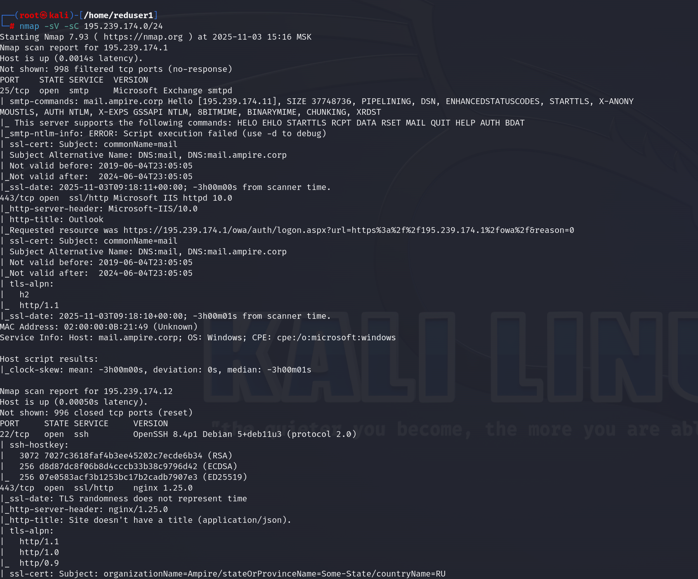{#fig-701 width=70%}

:::
::: {.column width="45%"}

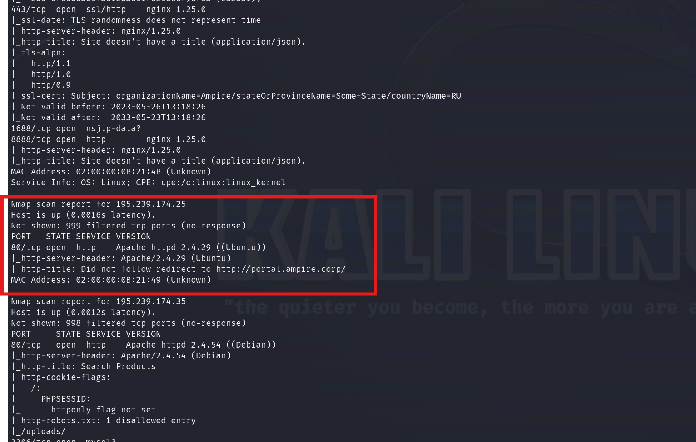{#fig-023 width=70%}

:::
::::::::::::::

## Получение meterpreter-сессии

:::::::::::::: {.columns align=center}
::: {.column width="60%"}

В результате сканирования обнаружено, что сервер с адресом 195.239.174.25 содержит открытый 80 порт (http), на котором располагается веб-портал portal.ampire.corp.
Для перехода на сайт портала организации необходимо добавить статическую запись в файл /etc/hosts с хостом этого сайта

:::
::: {.column width="30%"}

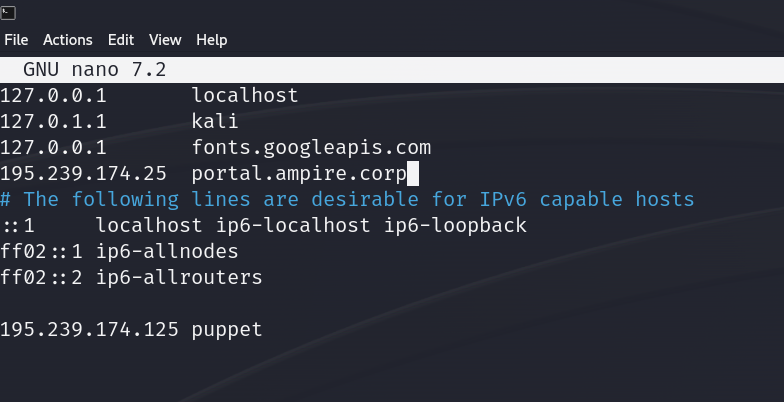{#fig-024 width=70%}

:::
::::::::::::::

## Получение meterpreter-сессии

:::::::::::::: {.columns align=center}
::: {.column width="60%"}

При переходе по адресу http://portal.ampire.corp в браузере откроется сайт портала организации. В нижней части страницы портала можно обнаружить информацию, что данный сайт создан с помощью CMS Wordpress

:::
::: {.column width="30%"}

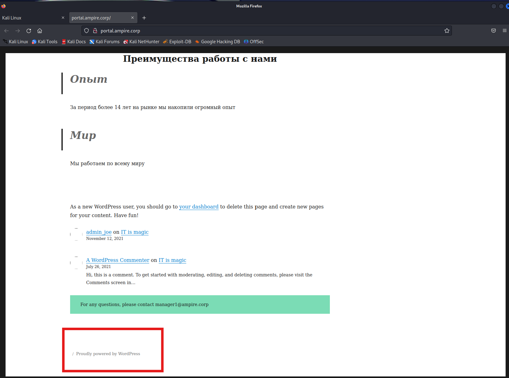{#fig-025 width=70%}

:::
::::::::::::::

## Получение meterpreter-сессии

:::::::::::::: {.columns align=center}
::: {.column width="60%"}

Сайт работает на CMS Wordpress, поэтому для поиска возможных векторов атаки можно произвести сканирование с помощью модуля Metasploit wordpress_scanner.

Metasploit Framework – инструмент, содержащий множество модулей для исследования и эксплуатации уязвимостей. Открыть фреймворк можно либо через программный менеджер в графическом интерфейсе, либо через команду msfconsole в терминале

:::
::: {.column width="30%"}

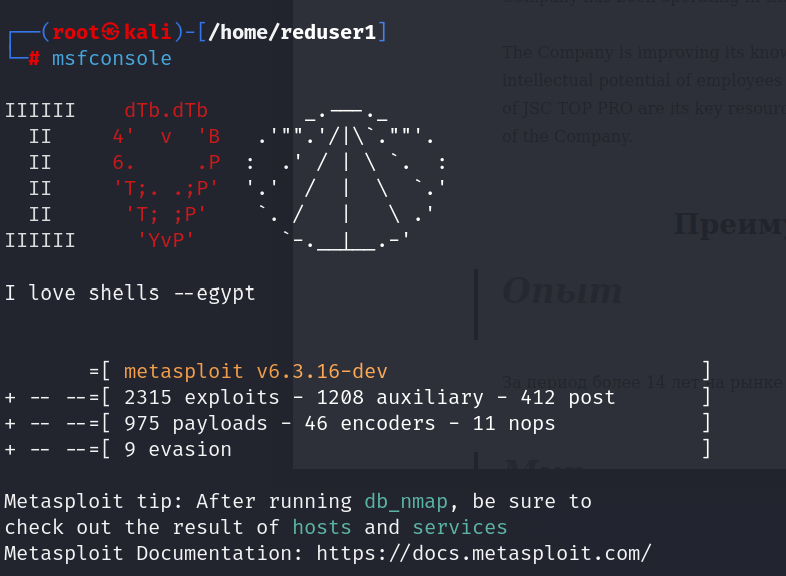{#fig-106 width=70%}

:::
::::::::::::::

## Получение meterpreter-сессии

:::::::::::::: {.columns align=center}
::: {.column width="50%"}

Для исследования CMS WordPress на уязвимости выберем подходящий модуль сканирования. Выполняем поиск подходящего модуля сканирования с помощью команды search wordpress scanner 

:::
::: {.column width="40%"}

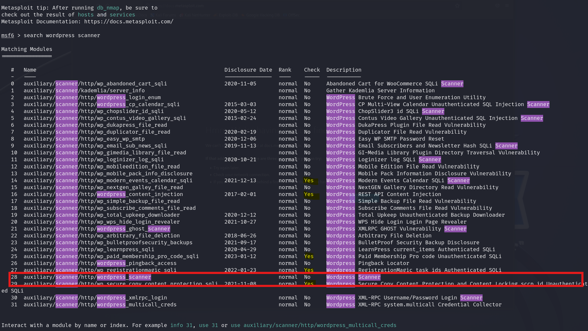{#fig-107 width=70%}

:::
::::::::::::::

## Получение meterpreter-сессии

:::::::::::::: {.columns align=center}
::: {.column width="60%"}

Наиболее подходящим под требуемые задачи инструментом является модуль 28 auxiliary/scanner/http/wordpress_scanner (отсканирует все в wordpress). Для выбора данного модуля используется команда use 28. Для правильной настройки модуля можно отобразить настраиваемые параметры с помощью команды options

:::
::: {.column width="30%"}

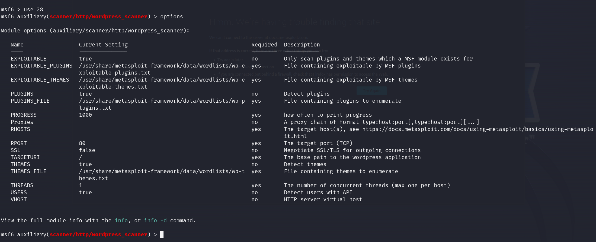{#fig-005 width=70%}

:::
::::::::::::::

## Получение meterpreter-сессии

:::::::::::::: {.columns align=center}
::: {.column width="60%"}

Для настройки модуля сканирования зададим параметр rhost, который определяет цель сканирования. В данном случае целью выступает portal.ampire.corp. Настройка производится с помощью команды set rhost portal.ampire.corp

:::
::: {.column width="30%"}

{#fig-702 width=70%}

:::
::::::::::::::

## Получение meterpreter-сессии

:::::::::::::: {.columns align=center}
::: {.column width="50%"}

После настройки модуль запускается с помощью команды run. Результатом сканирования является список используемых целевым сервисом плагинов

:::
::: {.column width="40%"}

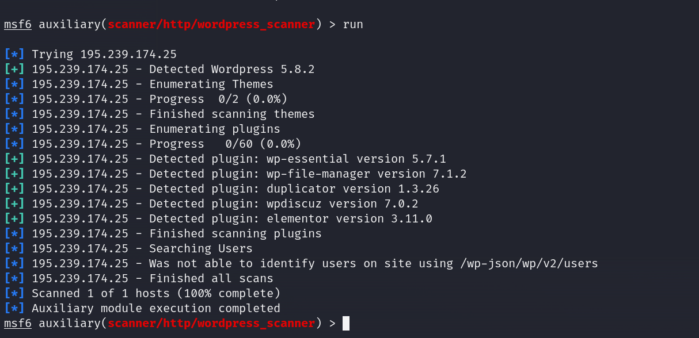{#fig-007 width=70%}

:::
::::::::::::::

## Получение meterpreter-сессии

После сканирования можно проверить, являются ли детектированные плагины уязвимыми:

- Wp-file-manager v7.1.2 не является уязвимым после версии 6.9;

- Duplicator является уязвимым и может быть проэксплуатирован
злоумышленником (Unauthenticated Arbitrary File Download - Неаутентифицированная произвольная загрузка файла);

- WpDiscuz содержит уязвимость, которая можно привести к
удаленному выполнению кода (CVE-2020-24186) - В плагине gVectors wpDiscuz версий 7.0–7.0.4 для WordPress существует уязвимость удаленного выполнения кода, которая позволяет неаутентифицированным пользователям загружать любые типы файлов, включая файлы PHP, через действие AJAX wmuUploadFiles.;

- Elementor не является уязвимым, но дополнение Essential может
быть использовано злоумышленником.

## Захват внешнего сайта; Эксплуатация плагина WpDiscuz

:::::::::::::: {.columns align=center}
::: {.column width="70%"}

Уязвимость, связанная с данным плагином, заключается в возможности загрузки произвольного файла на сервер с последующим удаленным выполнением произвольного кода (RCE). Для эксплуатации данной уязвимости потребуется только адрес
атакуемой машины и ссылка на любой пост с возможностью комментирования. IP-адрес атакуемой машины получен на первом этапе сканирования, адрес поста можно получить при просмотре записи после перехода по ссылке с главной страницы портала организации

:::
::: {.column width="20%"}

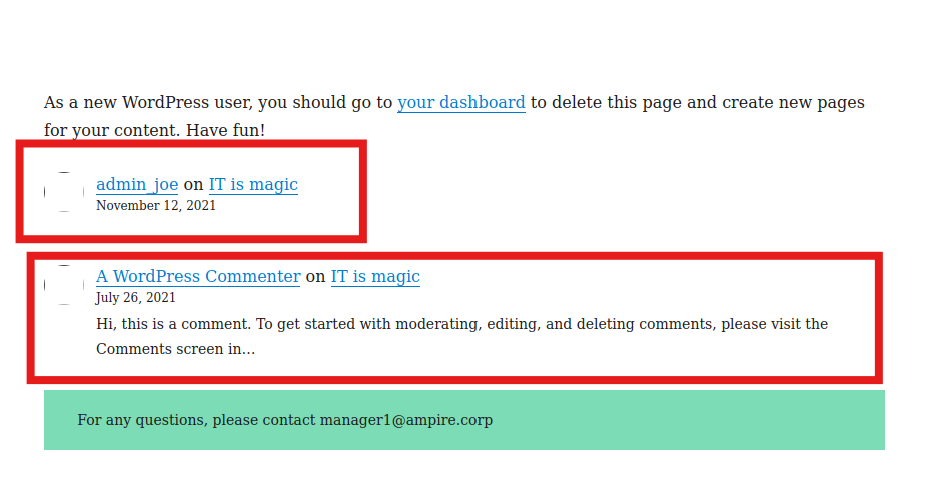{#fig-026 width=70%}

:::
::::::::::::::

## Эксплуатация плагина WpDiscuz

:::::::::::::: {.columns align=center}
::: {.column width="45%"}

После перехода по данной ссылке получим адрес поста, который будет использоваться при атаке /index.php/2021/07/26/hello-world/ 

:::
::: {.column width="45%"}

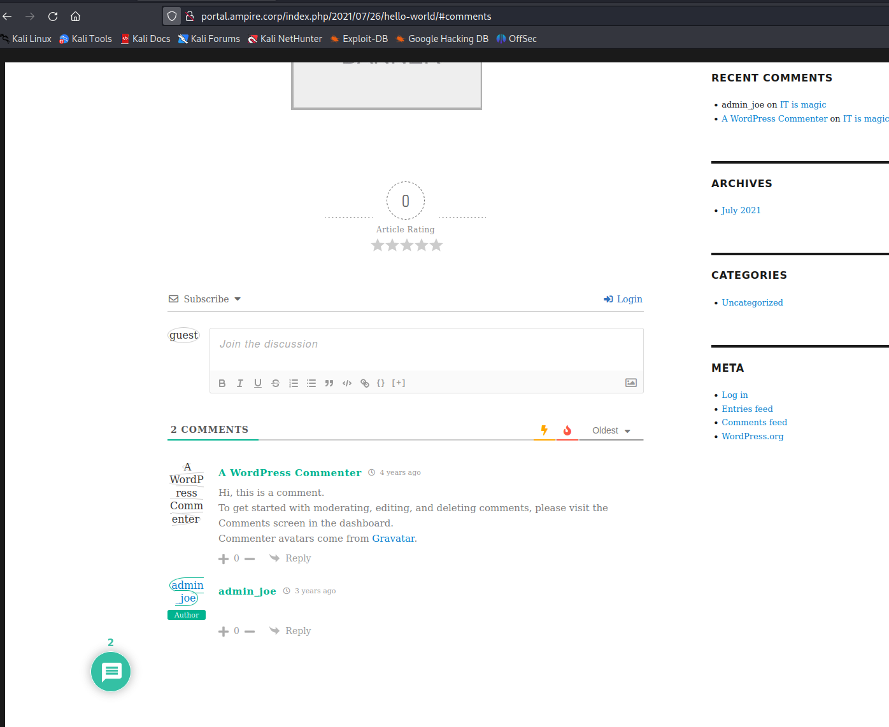{#fig-301 width=70%}

:::
::::::::::::::

## Эксплуатация плагина WpDiscuz

:::::::::::::: {.columns align=center}
::: {.column width="55%"}

Для отмены выбора модуля наберем в командной строке команду back. Далее осуществим поиск нужного exploit для выбранного плагина search wordpress exploit wp_wpdiscuz.
В консоли Metasploit отображается единственный найденный модуль exploit unix/webapp/wp_wpdiscuz_unauthenticated_file_upload, который выберем через команду use 0

:::
::: {.column width="35%"}

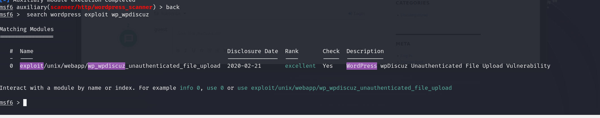{#fig-108 width=70%}

:::
::::::::::::::

## Эксплуатация плагина WpDiscuz

:::::::::::::: {.columns align=center}
::: {.column width="45%"}

С помощью команды options можно посмотреть доступные параметры для данного модуля 

:::
::: {.column width="45%"}

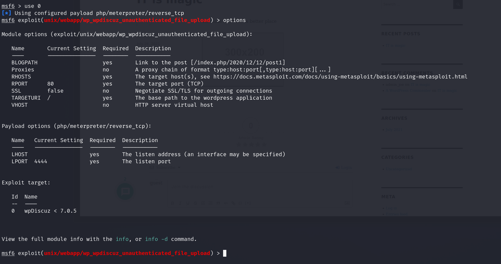{#fig-027 width=70%}

:::
::::::::::::::

## Эксплуатация плагина WpDiscuz

:::::::::::::: {.columns align=center}
::: {.column width="45%"}

Далее установим значения параметров для атаки, это интересующий нас хост и сама ссылка на пост с возможностью комментирования

:::
::: {.column width="45%"}

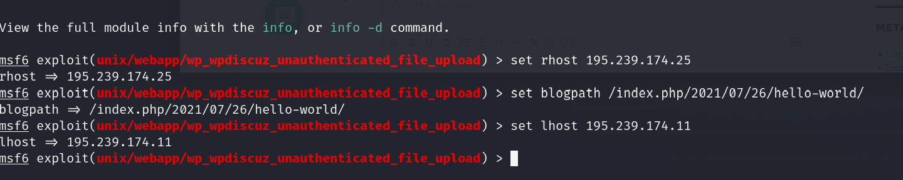{#fig-109 width=70%}

:::
::::::::::::::

## Эксплуатация плагина WpDiscuz

:::::::::::::: {.columns align=center}
::: {.column width="45%"}

В результате запуска модуля командой run получили meterpreter-сессию от имени пользователя «www-data» 

:::
::: {.column width="45%"}

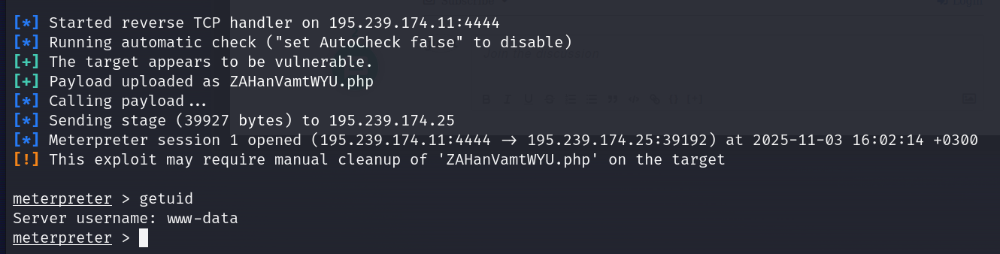{#fig-111 width=70%}

:::
::::::::::::::

## Способы получения флага; Поиск сервера баз данных

:::::::::::::: {.columns align=center}
::: {.column width="60%"}

После получения сессии с сайтом отобразили сетевые интерфейсы организации. Предложенная команда ipconfig сработала бы в системе Windows, для Linux нашли альтернативный вариант: после перехода из bash среды в shell используем команду `ip -a` или `ifconfig`, вывод у них по смыслу одинаковый. Для нас нагляднее вывод `ifconfig` 

:::
::: {.column width="30%"}

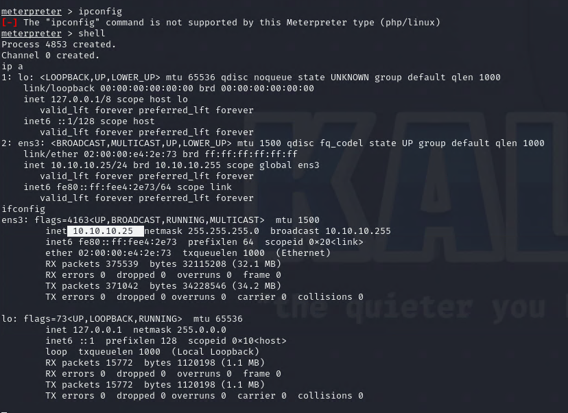{#fig-101 width=70%}

:::
::::::::::::::

## Поиск сервера баз данных

:::::::::::::: {.columns align=center}
::: {.column width="55%"}

На скриншоте обнаружили внутреннюю сеть 10.10.10.0/24. Перенаправить к данной сети маршрут с помощью команды autoroute (по факту происходит перебор всех сетей 10.10.10.х)

:::
::: {.column width="35%"}

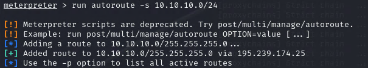{#fig-102 width=70%}

:::
::::::::::::::

## Поиск сервера баз данных

:::::::::::::: {.columns align=center}
::: {.column width="55%"}

Выполнили сканирование внутреннего периметра с помощью модуля multi/gather/ping_sweep. Для продолжения атаки просканировали все доступные хосты 10.10.10.х во внутренней сети с использованием модуля Multi Gather Ping Sweep.

:::
::: {.column width="35%"}

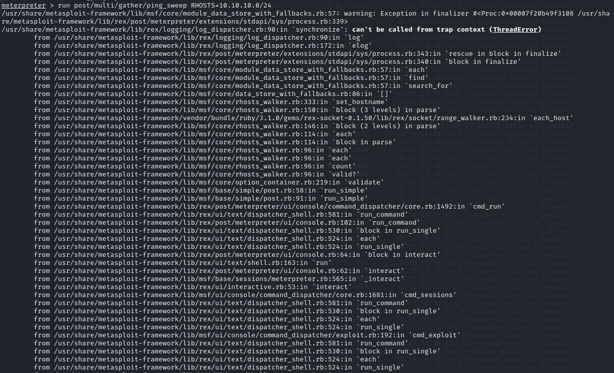{#fig-503 width=70%}

:::
::::::::::::::

## Поиск сервера баз данных

:::::::::::::: {.columns align=center}
::: {.column width="55%"}

После выполнения сканирования внутренней сети организации нашли все доступные хосты. Далее можно отобразить ARP-таблицу с IP и MAC адресами на атакуемой машине. Аналогично использовали альтернативную команду `arp -a` в среде `shell` 

:::
::: {.column width="35%"}

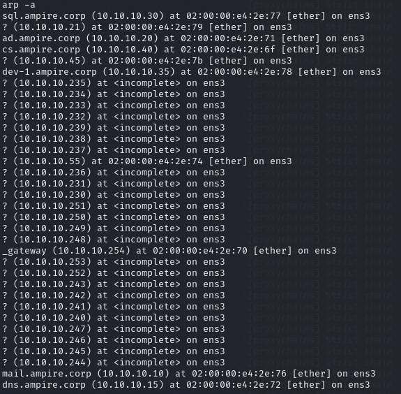{#fig-001 width=70%}

:::
::::::::::::::

## Поиск сервера баз данных

:::::::::::::: {.columns align=center}
::: {.column width="60%"}

Далее просканируем данные узлы для проверки наличия открытых портов. Перед сканированием настроим прокси-сервер:
- выходим из активной сессии с помощью команды background или bg;
- находим соответствующий модуль с помощью search socks_proxy;
- настроим данный модуль в соответствии с конфигурационным файлом /etc/proxychains.conf. 

:::
::: {.column width="30%"}

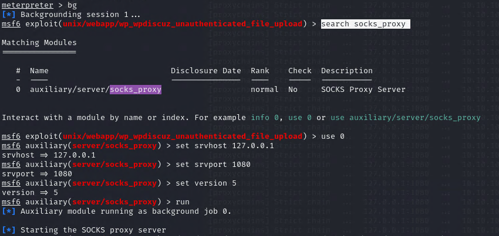{#fig-002 width=70%}

:::
::::::::::::::

## Поиск сервера баз данных

:::::::::::::: {.columns align=center}
::: {.column width="55%"}

Далее запускаем новый терминал kali. В новом теминале запустим сканирование 100 самых часто используемых портов с помощью команды proxychains nmap –n –sT –Pn --top-ports 100 {IP}.
В результате сканирования будут получены штатные порты серверов БД (порты с пометкой ОК)

:::
::: {.column width="35%"}

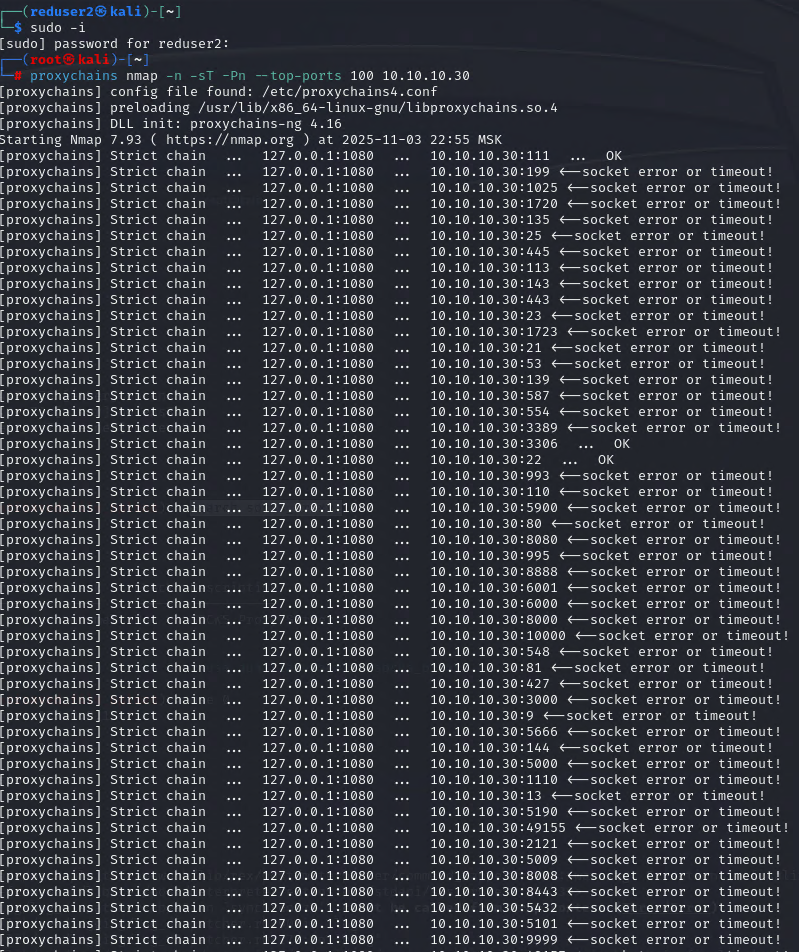{#fig-004 width=70%}

:::
::::::::::::::

## Поиск сервера баз данных

:::::::::::::: {.columns align=center}
::: {.column width="55%"}

В результате сканирования хоста 10.10.10.30 обнаружен открытый 3306 порт, который по умолчанию используется для подключения к СУБД MySQL. Предположительно то, что данный хост является искомым сервером БД. Следующим этапом будем получать доступ к данному серверу. Использовать атаку перебором, в качестве имени пользователя используем логин user.

:::
::: {.column width="35%"}

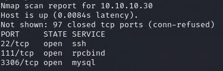{#fig-013 width=70%}

:::
::::::::::::::

## Bruteforce пароля

:::::::::::::: {.columns align=center}
::: {.column width="55%"}

Для реализации атаки перебором пароля сервера БД используем с учетной записью администратора bash-скрипт mysql_brute.sh, который находится по пути /usr/tools/mysql_brute/ 

:::
::: {.column width="35%"}

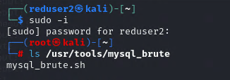{#fig-014 width=70%}

:::
::::::::::::::

## Bruteforce пароля

:::::::::::::: {.columns align=center}
::: {.column width="45%"}

Далее вернулись в предыдущий терминал с активным модулем server/socks_proxy и войшли в meterpreter-сессию просмотрев активные сессии и войдя с помощью команды `sessions -i 1`  

:::
::: {.column width="45%"}

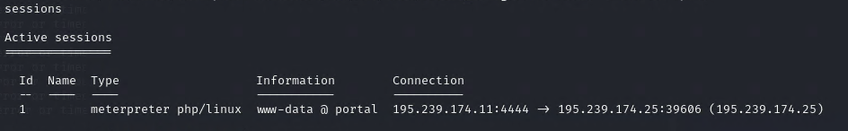{#fig-015 width=70%}

:::
::::::::::::::

## Bruteforce пароля

:::::::::::::: {.columns align=center}
::: {.column width="45%"}

Следующим этапом загружаем на скомпрометированный узел в сегменте DMZ два файла: bash-скрипт mysql_brute.sh и файл с паролями rockyou.txt 

:::
::: {.column width="45%"}

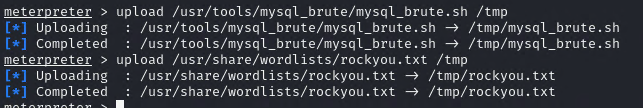{#fig-016 width=70%}

:::
::::::::::::::

## Bruteforce пароля

:::::::::::::: {.columns align=center}
::: {.column width="45%"}

В данном случае два файла загружаются в папку /tmp ([рис. @fig-017]). Далее в активной meterpreter-сессии перейдем в shell и запустим bash-скрипт, который подберет пароль к учетной записи от MySQL.

:::
::: {.column width="45%"}

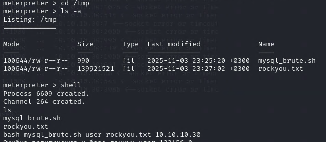{#fig-017 width=70%}

:::
::::::::::::::

## Bruteforce пароля

:::::::::::::: {.columns align=center}
::: {.column width="60%"}

Bash-скрипт mysql_brute.sh принимает на вход три аргумента в таком порядке:

- имя пользователя user;

- файл с паролями rockyou.txt;

- IP-адрес машины с MySQL – 10.10.10.30.

В результате работы скрипта получили пароль, который можно использовать для удаленного подключения к серверу БД

:::
::: {.column width="30%"}

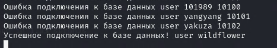{#fig-018 width=70%}

:::
::::::::::::::

## Bruteforce пароля

:::::::::::::: {.columns align=center}
::: {.column width="45%"}

Для получения доступа к машине воспользуемся подключением MySQL по полученным учетным данным. Подключение выполняется с атакующей машины kali, для подключения используется
proxychains 

:::
::: {.column width="45%"}

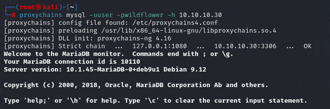{#fig-019 width=70%}

:::
::::::::::::::

## Bruteforce пароля

:::::::::::::: {.columns align=center}
::: {.column width="45%"}

Для получения флага необходимо вывести таблицы БД «Flag»

:::
::: {.column width="45%"}

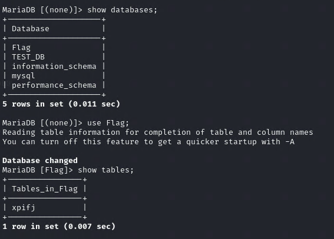{#fig-020 width=70%}

:::
::::::::::::::

## Результат

После получения флага необходимо было ввести его в соответствующее поле на сайте платформы, после чего мы получим сообщение о том, что основная задача выполнена. Далее заполняем отчет по атаке на ресурс.

:::::::::::::: {.columns align=center}
::: {.column width="45%"}

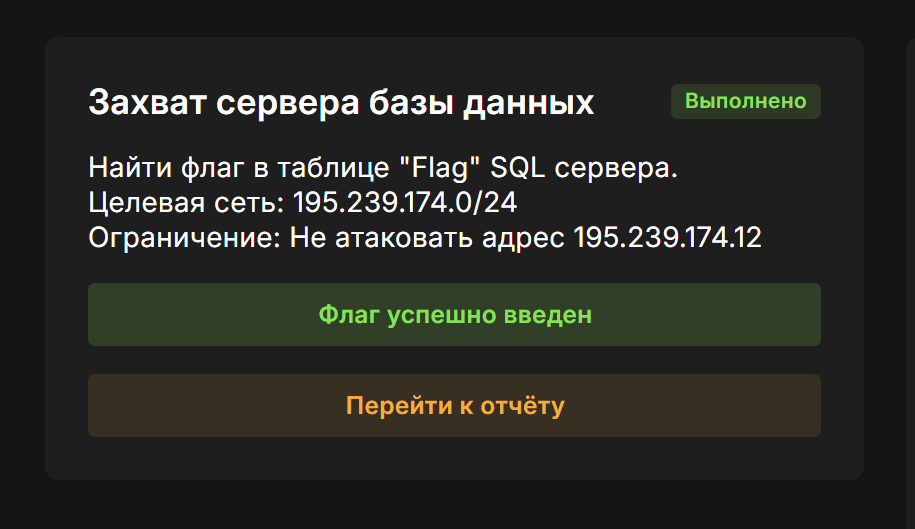{#fig-901 width=70%}

:::
::: {.column width="45%"}

{#fig-902 width=70%}

:::
::::::::::::::

## Выводы

В ходе лабораторной работы были успешно получены meterpreter-сессия и доступ к флагу, а также прописан отчет с целью закрытия найденных уязвимостей в будущем.

## 

Спасибо за внимание!
