---
## Author
author:
    - Александрова У.В.,
    - Волгин И.А,
    - Голощапов Я.В.,
    - Дворкина Е.В.,
    - Серегина И.А.
## Title
title: "Отчет по лабораторной работе №5-B «ЗАХВАТ КОНТРОЛЛЕРА ДОМЕНА»"
subtitle: "Кибербезопасность предприятия"
license: CC BY
date: today
date-format: "YYYY-MM-DD" # Example: 2025-10-15
---

## Cостав команды

Александрова Ульяна Вадимовна

Волгин Иван Алексеевич

Голощапов Ярослав Вячеславович

Дворкина Ева Владимировна

Серёгина Ирина Андреевна

## Цели и задачи

Целью данной лабораторной работы является освоение практических навыков утсановления meterpreter-сессии и получение доступа к контроллеру домена.

Задача: Во внутреннем сегменте организации необходимо получить доступ к контроллеру домена. У доменного пользователя «Flag», в одном из полей свойств пользователя необходимо найти флаг.

## Получение meterpreter-сессии

Перед началом атаки провести разведку путем сканирования. На основе исходных данных определить адрес подсети, в которой находится целевой сервер – 195.239.174.0/24. Для обнаружения уязвимых узлов используется сканер nmap.

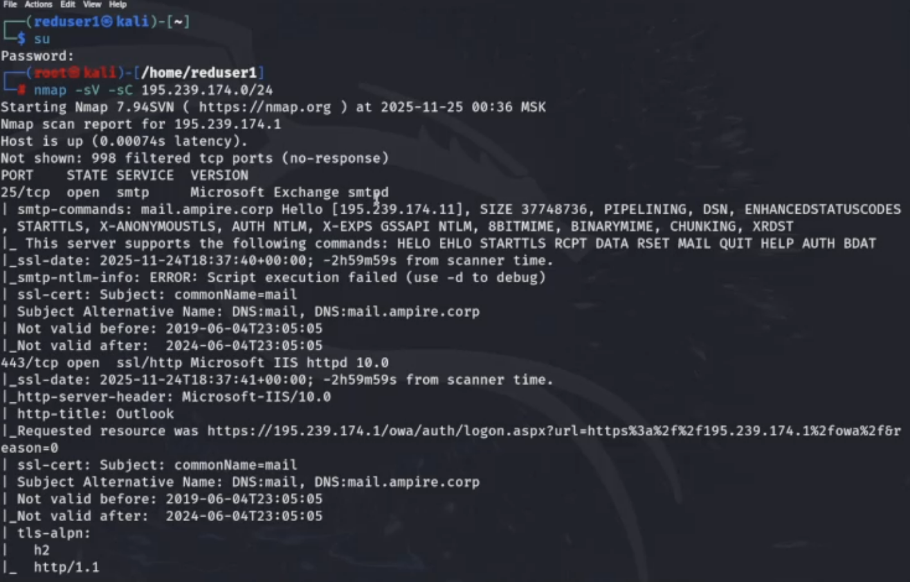{#fig-001 width=70%}

##

В результате сканирования обнаружено, что сервер с адресом 195.239.174.25 содержит открытый 80 порт (http), на котором располагается веб-портал portal.ampire.corp. Для перехода на сайт портала организации необходимо добавить статическую запись в файл /etc/hosts.

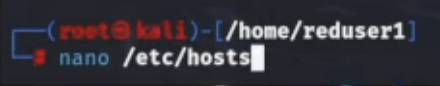{#fig-002 width=70%}

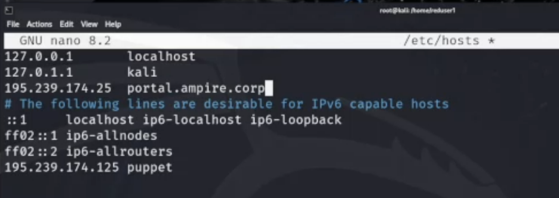{#fig-003 width=70%}

##

Используем модуль exploit unix/webapp/wp_wpdiscuz_unauthenticated_file_upload

{#fig-004 width=70%}

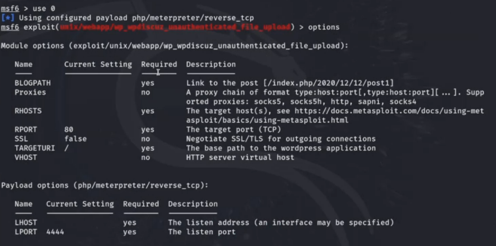{#fig-005 width=70%}

##

Устанавливаем значения параметров для атаки.

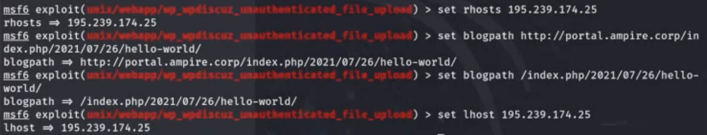{#fig-006 width=70%}

## Описание сценария

Для прохождения данного сценария в первую очередь потребуется активная meterpreter-сессия с узлом в сегменте DMZ. Вариант получения meterpreter-сессии с корпоративным сайтом с помощью модуля wp_wpdiscuz_unauthenticated_file_upload представлен на скриншотах 

:::::::::::::: {.columns align=center}
::: {.column width="45%"}

{#fig-007 width=70%}

:::
::: {.column width="45%"}

{#fig-008 width=70%}

:::
::::::::::::::

##

Вариант получения meterpreter-сессии с почтовым сервером с помощью модуля exchange_proxyshell_rce представлен на скриншотах.

:::::::::::::: {.columns align=center}
::: {.column width="45%"}

{#fig-009 width=70%}

:::
::: {.column width="45%"}

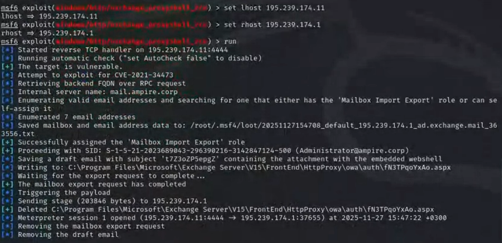{#fig-010 width=70%}

:::
::::::::::::::

##

После получения сессии нужно проверить, находится ли эксплуатируемый узел в домене.

:::::::::::::: {.columns align=center}
::: {.column width="45%"}

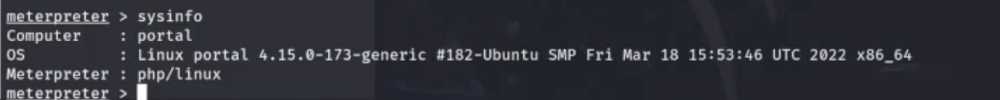{#fig-011 width=70%}

:::
::: {.column width="45%"}

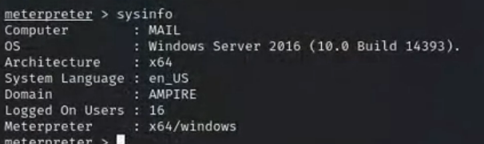{#fig-012 width=70%}

:::
::::::::::::::

##

Можно свернуть активную сессию с помощью команды background (или bg) и просмотреть список активных сессий с помощью команды sessions.

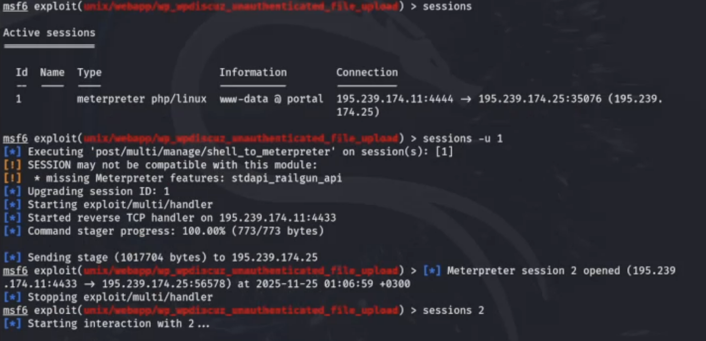{#fig-013 width=70%}

 

## Доступ во внутреннюю сеть через узел не в домене

В первую очередь необходимо узнать, какие интерфейсы имеются на машине во внутренней сети, поиск выполняется в shell-оболочке с помощью команды ip a. Для продолжения атаки необходимо просканировать все доступные хосты во внутренней сети.

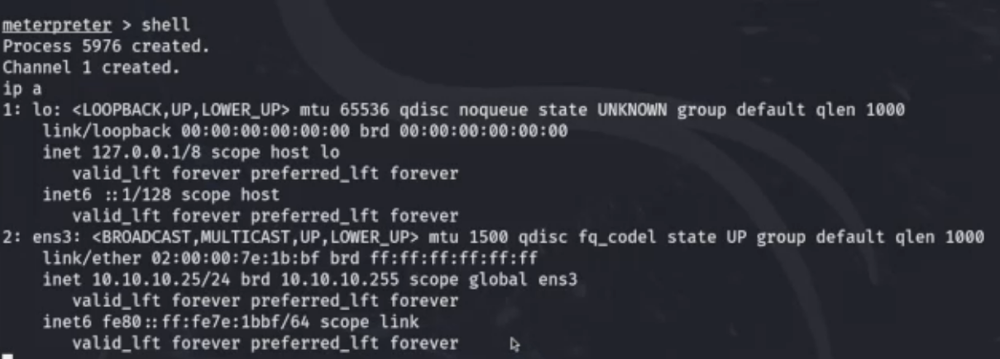{#fig-014 width=70%}

{#fig-015 width=70%}

##

Необходимо прописать маршрут до активной meterpreter-сессии. Далее выполнить проброс портов во внутреннюю сеть для дальнейшего выполнения команд через технику proxychains..

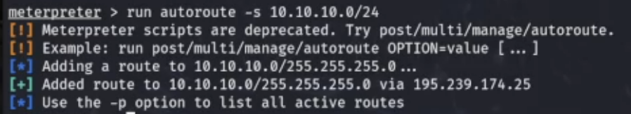{#fig-016 width=70%}

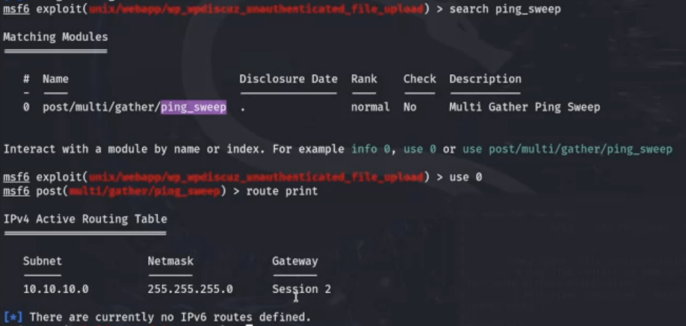{#fig-017 width=70%}

##

Смотрим содержимое файла с помощью команды cat /etc/proxychains4.con.

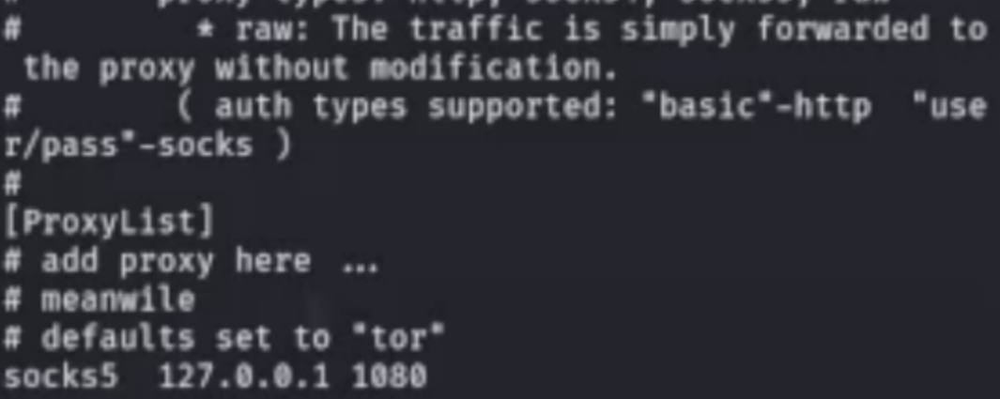{#fig-018 width=70%}

##

Возвращаемся к окну терминала с активной сессией и сворачиваем данную сессию с помощью команды bg, выбираем, настриваем и запускаем модуль socks_proxy

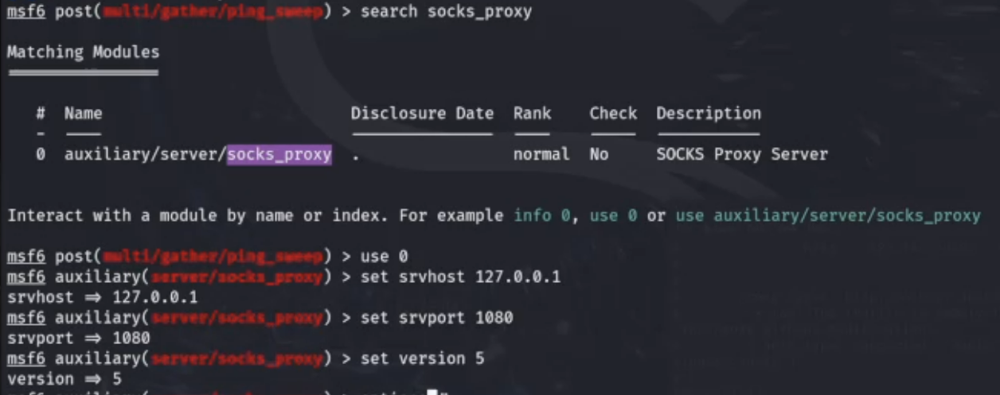{#fig-019 width=70%}

{#fig-020 width=70%}

##

В окне терминала, где просматривался файл /etc/proxychains.conf, можно запустить сканирование 100 самых часто используемых портов

{#fig-021 width=70%}

## Bruteforce пароля и использование ldapsearch

Mожно реализовать атаку перебором с использованием словаря паролей rockyou.txt.

{#fig-022 width=70%}

##

Данные учетной записи получены при атаке перебором. В результатах найти параметр description.

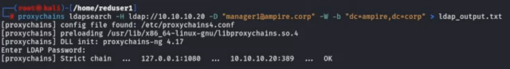{#fig-023 width=70%}

{#fig-024 width=70%}

## Zerologon CVE 2020-1472

Дополнительный возможный вектор атаки на котроллер домена заключается в эксплуатации уязвимости Zerologon. 

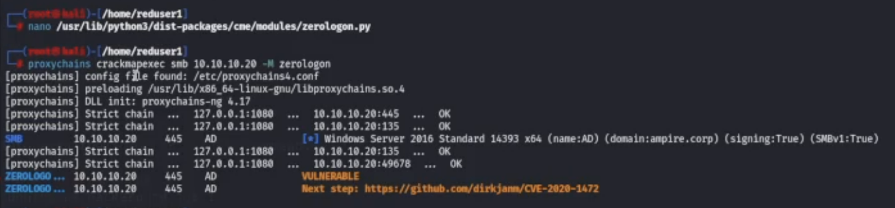{#fig-025 width=70%}

{#fig-026 width=70%}

##

 Для получения сессии с контроллером домена указать обязательные параметры модуля.

{#fig-027 width=70%}

{#fig-028 width=70%}

##

С помощью команды net user /domain Flag вывести полную информацию о пользователе «Flag». 

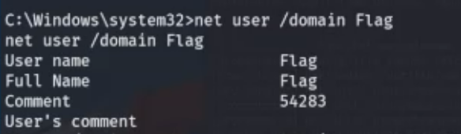{#fig-029 width=70%}

## Доступ во внутреннюю сеть через доменный узел

Данный подраздел описывает процесс получения флага через узел, который находится под управлением контроллера домена. 

{#fig-030 width=70%}

## Результаты

С помощью команды net user /domain Flag вывести полную информацию о пользователе «Flag». В результате будет получен флаг в поле описания пользователя ([рис. @fig-031]).

{#fig-031 width=70%}

## Ввыводы

В ходе лабораторной работы были успешно получены практические навыки утсановления meterpreter-сессии и получения доступа к контроллеру домена.

## 

Спасибо за внимание!
