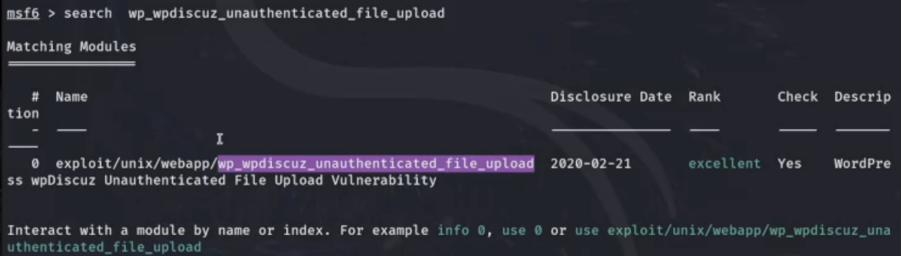
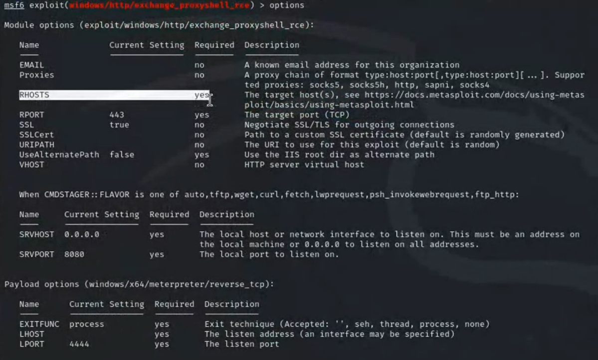
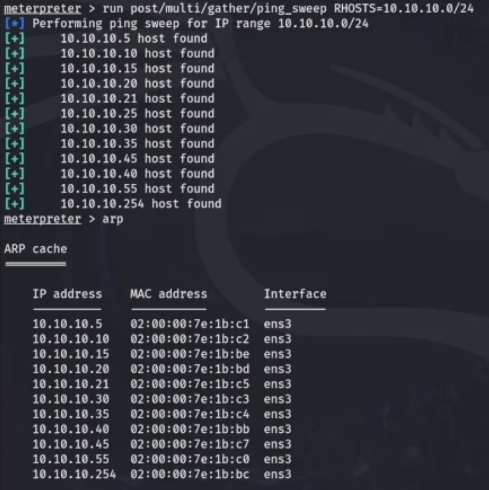
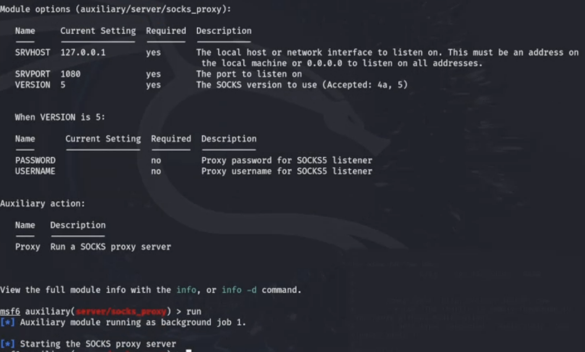
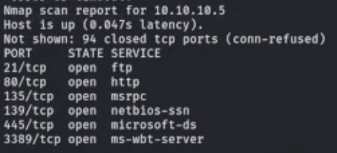
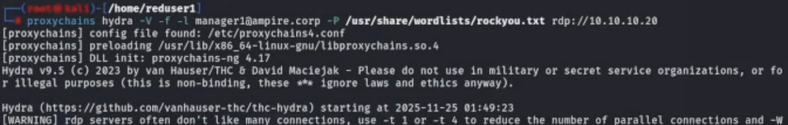
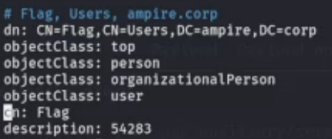
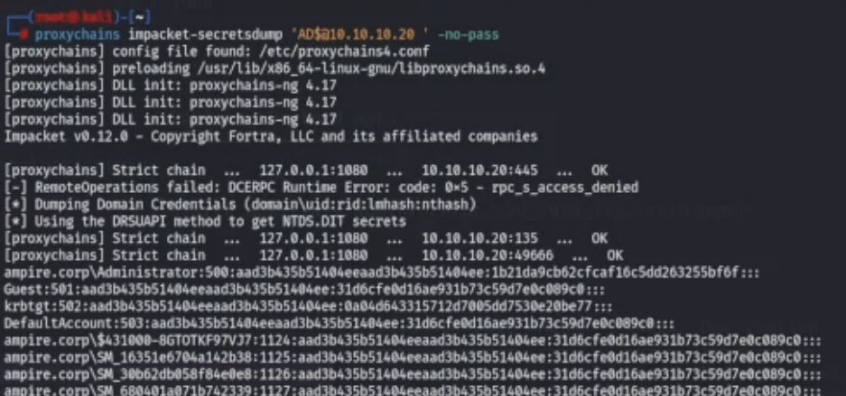
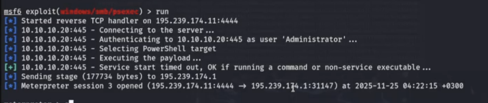
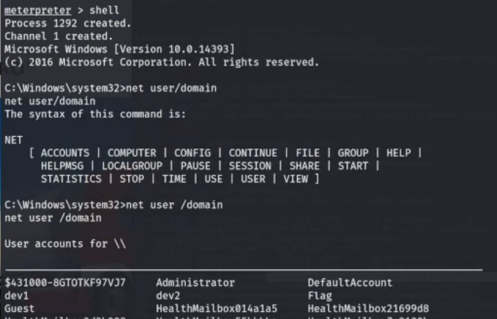

---
## Author
author:
    - Александрова У.В.,
    - Волгин И.А,
    - Голощапов Я.В.,
    - Дворкина Е.В.,
    - Серегина И.А.

## Title
title: "Отчет по лабораторной работе №5-B «ЗАХВАТ КОНТРОЛЛЕРА ДОМЕНА»"
subtitle: "Кибербезопасность предприятия"
license: "CC BY"
---

# Цель работы

Целью данной лабораторной работы является освоение практических навыков утсановления meterpreter-сессии и получение доступа к контроллеру домена.

# Задание

- Получить доступ к контроллеру домена

# Выполнение лабораторной работы

## Описание сценария

Во внутреннем сегменте организации необходимо получить доступ к контроллеру домена. У доменного пользователя «Flag», в одном из полей свойств пользователя необходимо найти флаг.

### Получение meterpreter-сессии

Перед началом атаки провести разведку путем сканирования. На основе исходных данных определить адрес подсети, в которой находится целевой сервер – 195.239.174.0/24. Для обнаружения уязвимых узлов используется сканер nmap – это инструмент сканирования сетей, который позволяет настраивать сканирование с помощью передаваемых через командную строку флагов ([рис. @fig-001]).
Применяемые флаги:
 -sV – проверяет открытые порты для определения информации о
службе/версии;
 -sC – производит сканирование скриптов.

{#fig-001 width=70%}

В результате сканирования обнаружено, что сервер с адресом 195.239.174.25 содержит открытый 80 порт (http), на котором располагается веб-портал portal.ampire.corp. Для перехода на сайт портала организации необходимо добавить
статическую запись в файл /etc/hosts ([рис. @fig-002]), ([рис. @fig-003]).

{#fig-002 width=70%}

{#fig-003 width=70%}

Уязвимость, связанная с данным плагином, заключается в возможности загрузки произвольного файла на сервер с последующим удаленным выполнением произвольного кода (RCE). Плагин разработан таким образом, чтобы разрешать пользователям прикреплять к сообщениям только изображения, но уязвимые версии WpDiscuz не могут корректно проверить тип прикрепляемых файлов, в результате чего пользователи получают возможность загружать на сервер файлы любого типа, включая файлы PHP. Для эксплуатации данной уязвимости потребуется только адрес атакуемой машины и ссылка на любой пост с возможностью комментирования.

Используем модуль exploit unix/webapp/wp_wpdiscuz_unauthenticated_file_upload ([рис. @fig-004]).

{#fig-004 width=70%}

С помощью команды options можно посмотреть доступные параметры для данного модуля ([рис. @fig-005]).

{#fig-005 width=70%}

Устанавливаем значения параметров для атаки ([рис. @fig-006]).

{#fig-006 width=70%}

## Описание сценария

Для прохождения данного сценария в первую очередь потребуется активная meterpreter-сессия с узлом в сегменте DMZ. Вариант получения meterpreter-сессии с корпоративным сайтом с помощью модуля wp_wpdiscuz_unauthenticated_file_upload представлен на скриншотах ([рис. @fig-007]), ([рис. @fig-008]).

{#fig-007 width=70%}

{#fig-008 width=70%}

Вариант получения meterpreter-сессии с почтовым сервером с помощью
модуля exchange_proxyshell_rce представлен на скриншотах ([рис. @fig-009]), ([рис. @fig-010]).

{#fig-009 width=70%}

{#fig-010 width=70%}

После получения сессии нужно проверить, находится ли эксплуатируемый узел в домене. Проверка выполняется с помощью команды sysinfo, которую нужно вводить в активную meterpreter-сессию ([рис. @fig-011]), ([рис. @fig-012]).

{#fig-011 width=70%}

{#fig-012 width=70%}

Можно свернуть активную сессию с помощью команды background (или bg) и просмотреть список активных сессий с помощью команды sessions ([рис. @fig-013]).

{#fig-013 width=70%}
 
В случае получения сессии с корпоративным сайтом (модуль wordpress) для успешного выполнения дальнейших операций с атакуемой машиной необходимо повысить текущую сессию ([рис. @fig-013]).

## Способы получения флага

### Доступ во внутреннюю сеть через узел не в домене

Данный подраздел описывает процесс получения флага через узел, который не находится под управлением контроллера домена.
В первую очередь необходимо узнать, какие интерфейсы имеются на машине во внутренней сети, поиск выполняется в shell-оболочке с помощью команды ip a ([рис. @fig-014]).

{#fig-014 width=70%}

Для продолжения атаки необходимо просканировать все доступные хосты во внутренней сети с помощью модуля Multi Gather Ping Sweep. Произойдет сканирование внутренней сети организации и будут найдены все доступные хосты. Далее можно посмотреть ARP-таблицу на атакуемой машине с помощью команды arp в meterpreter-сессии ([рис. @fig-015]).

{#fig-015 width=70%}

Поскольку целевой адрес атакуемого узла находится во внутренней подсети рганизации, то необходимо прописать маршрут до активной meterpreter-сессии. Далее выполнить проброс портов во внутреннюю сеть для дальнейшего выполнения команд через технику proxychains. ([рис. @fig-016]).

{#fig-016 width=70%}

С помощью команды route print можно посмотреть активные маршруты в рамках текущей сессии ([рис. @fig-017]).

{#fig-017 width=70%}

Далее необходимо просканировать доступные хосты во внутренней подсети на наличие открытых портов с использованием модуля nmap. Так как сканируемые машины находятся во внутренней сети, то в первую очередь необходимо настроить прокси, через который будут проходить все запросы при сканировании. Для этого нужно применить и настроить модуль metasploit auxiliary/server/socks_proxy.

Основные параметры указанного модуля должны совпадать с конфигурационным файлом /etc/proxychains4.conf. Смотрим содержимое файла с помощью команды cat /etc/proxychains4.con ([рис. @fig-018]).

{#fig-018 width=70%}

Возвращаемся к окну терминала с активной сессией и сворачиваем данную сессию с помощью команды bg, выбираем, настриваем и запускаем модуль socks_proxy ([рис. @fig-019]), ([рис. @fig-020]).

{#fig-019 width=70%}

{#fig-020 width=70%}

В окне терминала, где просматривался файл /etc/proxychains.conf, можно запустить сканирование 100 самых часто используемых портов с помощью команды proxychains nmap –n –sT –Pn - top-ports 100 {IP}.

{#fig-021 width=70%}

#### Bruteforce пароля и использование ldapsearch

В результате сканирования сети ([рис. @fig-021]) будет получен список открытых портов. На узле обнаружен открытый порт 3389, который по умолчанию используется для подключения по протоколу RDP. Можно использовать указанный порт для доступа к контроллеру домена.

Mожно реализовать атаку перебором с использованием словаря паролей rockyou.txt, который находится по пути /usr/share/wordlists/. Запустить утилиту hydra, используя электронную почту для связи с менеджером, с помощью команды proxychains hydra –V –f-manager1@ampire.corp –P rockyou.txt rdp://10.10.10.20 ([рис. @fig-022]).

{#fig-022 width=70%}

Так как флаг находится в описании одного из доменных пользователей, то для получения флага не обязательно получать сессию с контроллером домена. Вывести информацию о всех доменных пользователях можно с помощью команды proxychains ldapsearch -H ldap://10.10.10.20 -D "manager1@ampire.corp" -W -b "dc=ampire,dc=corp" ([рис. @fig-023]).

Данные учетной записи получены при атаке перебором. В результатах
найти параметр description ([рис. @fig-024]).

{#fig-023 width=70%}

{#fig-024 width=70%}

#### Zerologon CVE 2020-1472

Дополнительный возможный вектор атаки на котроллер домена заключается в эксплуатации уязвимости Zerologon. Для проверки подверженности узла данной уязвимости можно использовать утилиту crackmapexec. В результате выполнения команды proxychains crackmapexec smb 10.10.10.20 -M zerologon можно узнать NetBIOS name атакуемой машины, в данном случае – это AD ([рис. @fig-025]).

{#fig-025 width=70%}

Далее для получения дампа хешей учетных записей контроллера домена можно воспользоваться командой proxychains impacket-secretdump 'AD$@10.10.10.20 ' -no-pass, что необходимо выполнить в другом окне терминала ([рис. @fig-026]).

{#fig-026 width=70%}

В результате будет получен дамп хеша пароля от аккаунта администратора, данный хеш можно применить для подключения с помощью модуля metasploit /windows/smb/psexec. Для получения сессии с контроллером домена указать обязательные параметры модуля, для чего вернуться в окно терминала с открытой msfconsole – use exploit/windows/smb/psexec ([рис. @fig-027]).

{#fig-027 width=70%}

В активной meterpreter-сессии можно перейти в shell-оболочку с помощью команды shell ([рис. @fig-028]).

{#fig-028 width=70%}

С помощью команды net user /domain Flag вывести полную информацию о пользователе «Flag». В результате будет получен флаг в поле описания пользователя ([рис. @fig-029]).

{#fig-029 width=70%}

### Доступ во внутреннюю сеть через доменный узел

Данный подраздел описывает процесс получения флага через узел, который находится под управлением контроллера домена. В данном случае получить флаг можно с использованием команды net user, для чего в активной meterpreter-сессии перейти в shell-оболочку с помощью команды shell ([рис. @fig-030]).

{#fig-030 width=70%}

С помощью команды net user /domain Flag вывести полную информацию о пользователе «Flag». В результате будет получен флаг в поле описания пользователя ([рис. @fig-031]).

{#fig-031 width=70%}

# Выводы

В ходе лабораторной работы были успешно получены практические навыки утсановления meterpreter-сессии и получения доступа к контроллеру домена.

# Список литературы{.unnumbered}

::: {#refs}
:::
